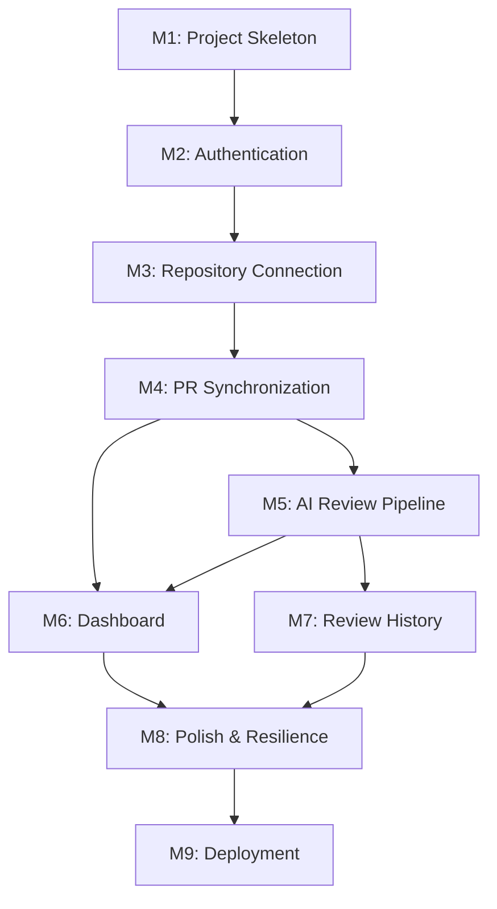

# MergeFlow — Implementation Plan

> **Status:** Final | **Created:** 2026-07-05 | **Document ID:** `IMPLEMENTATION_PLAN.md`
> **References:** 
> - `docs/00-project-overview.md`
> - `docs/01-product-specification.md`
> - `docs/02-domain-analysis.md`
> - `docs/03-system-architecture.md`
> - `docs/04-database-design.md`

---

## 1. Principles of this Roadmap

1. **Independently Shippable:** Every milestone produces a working, testable system.
2. **Vertical Slices:** We build features end-to-end (Feature → Database → Logic → API → UI → Testing → Commit), not horizontal layers.
3. **Just-in-Time Infrastructure:** No tables or services are created until the feature demands them.
4. **Time-Boxed:** Each milestone is scoped for 2–6 hours of focused engineering.

---

## 2. Consistency Check

Before planning, we verified that all functional requirements from `01-product-specification.md` are accounted for in the milestones below.

| Requirement | Description | Covered In Milestone |
|-------------|-------------|----------------------|
| **UFR-1** | Authenticate with GitHub | M2 (Authentication) |
| **UFR-2** | View Accessible Repositories | M3 (Repository Connection) |
| **UFR-3** | Connect Repository | M3 (Repository Connection) |
| **UFR-4** | Disconnect Repository | M3 (Repository Connection) |
| **UFR-5** | Trigger PR Sync | M4 (PR Synchronization) |
| **UFR-6** | Request AI Analysis | M5 (AI Review Pipeline) |
| **UFR-7** | View AI Review | M6 (Dashboard & PR Details) |
| **UFR-8** | View Review History | M7 (Review History) |
| **UFR-9** | View Dashboard | M6 (Dashboard & PR Details) |
| **UFR-10**| Re-Sync PRs | M4 (PR Synchronization) |
| **SFR-1** | Persist Identity | M2 (Authentication) |
| **SFR-2** | Manage OAuth Tokens | M2 (Authentication) |
| **SFR-3** | Persist Repositories | M3 (Repository Connection) |
| **SFR-4** | Execute PR Sync | M4 (PR Synchronization) |
| **SFR-5** | Execute AI Pipeline | M5 (AI Review Pipeline) |
| **SFR-6** | Persist Reviews (Append-only) | M5 (AI Review Pipeline) |
| **SFR-7** | Maintain Auditability | M5 (AI Review Pipeline) |
| **SFR-8** | Enforce Sync Policy | M4 (PR Synchronization) |

*Validation passes. All requirements are mapped to a specific vertical slice.*

---

## 3. Milestones

### M1: Project Initialization & Walking Skeleton

**Objective:** Establish the foundation, tooling, and deployment readiness.
**Business Value:** Zero to one. Guarantees the team has a working environment and CI/CD pipeline before writing business logic.
**Architecture Documents:** `03-system-architecture.md`
**Files Expected To Change:** `package.json`, `tsconfig.json`, `tailwind.config.js`, `app/layout.tsx`, `app/page.tsx`, `README.md`
**Database Changes:** Initialize DB connection and ORM setup (no domain tables yet).
**Business Logic:** Basic routing.
**API Contracts Used:** None.
**UI Components:** Landing Page shell, typography, color tokens.
**Acceptance Criteria:**
1. App compiles and runs locally.
2. Linter and formatter pass in CI.
3. Landing page renders.
**Manual Test Plan:** Run `npm run dev`, verify `localhost:3000` loads. Run `npm run lint`.
**Potential Risks:** Tooling conflicts (e.g., specific framework versions).
**Estimated Time:** 2 hours.
**Suggested Git Commit:** `chore: initialize project skeleton and tooling`
**Concepts I Will Learn:** Project scaffolding, strict TS configuration, basic styling setup.

---

### M2: Authentication Vertical Slice

**Objective:** Implement GitHub OAuth, user persistence, and session management.
**Business Value:** Secures the app and establishes user identity, unlocking all downstream features.
**Architecture Documents:** `02-domain-analysis.md` (Auth Domain), `03-system-architecture.md` (§8.1), `04-database-design.md` (§4.1, §4.2)
**Files Expected To Change:** Schema files, Auth service, API routes, Layout header.
**Database Changes:** Create `users` and `sessions` tables.
**Business Logic:** OAuth PKCE flow, session cookie creation/validation, token encryption.
**API Contracts Used:** `InitiateOAuth`, `CompleteOAuth`, `GetCurrentUser`, `InvalidateSession`.
**UI Components:** "Sign in with GitHub" button, User Avatar dropdown, restricted route wrapper.
**Acceptance Criteria:**
1. User can click sign in and complete GitHub OAuth.
2. User record is created in DB.
3. Session cookie is set and protects private routes.
4. User can log out.
**Manual Test Plan:** Sign in via browser. Verify DB has user and encrypted token. Delete cookie manually, verify redirect to landing page.
**Potential Risks:** Handling OAuth state/CSRF correctly; token encryption key management.
**Estimated Time:** 4 hours.
**Suggested Git Commit:** `feat(auth): implement GitHub OAuth and session management`
**Concepts I Will Learn:** OAuth 2.0 flow, secure cookie management, encryption-at-rest.

---

### M3: Repository Connection Slice

**Objective:** Fetch, display, and persist user repositories.
**Business Value:** Allows users to define their workspace boundary by selecting which codebases to monitor.
**Architecture Documents:** `02-domain-analysis.md` (Repo Domain), `03-system-architecture.md` (§8.2), `04-database-design.md` (§4.3)
**Files Expected To Change:** Repo schema, Repo service, API routes, Repositories UI page.
**Database Changes:** Create `repositories` table.
**Business Logic:** Fetch paginated repos from GitHub API using decrypted token; mark connected status; handle connect/disconnect idempotency.
**API Contracts Used:** `ListAccessibleRepos`, `ConnectRepositories`, `DisconnectRepository`.
**UI Components:** Repository list, search filter, Connect/Disconnect toggle buttons.
**Acceptance Criteria:**
1. Renders all accessible GitHub repos.
2. Clicking "Connect" persists repo to DB.
3. Clicking "Disconnect" updates status to `DISCONNECTED`.
**Manual Test Plan:** Revoke GitHub access manually on GitHub's site and ensure the app gracefully handles the 401/403 when fetching repos.
**Potential Risks:** GitHub API pagination handling; rate limits if user has hundreds of repos.
**Estimated Time:** 4 hours.
**Suggested Git Commit:** `feat(repo): implement repository discovery and connection`
**Concepts I Will Learn:** GitHub REST API, domain-driven API boundaries.

---

### M4: Pull Request Synchronization Slice

**Objective:** Fetch PR data based on the Sync Policy and persist it.
**Business Value:** Surfaces the actual work (PRs) that needs analysis.
**Architecture Documents:** `02-domain-analysis.md` (PR Domain), `03-system-architecture.md` (§8.3), `04-database-design.md` (§4.4, §4.6)
**Files Expected To Change:** PR schema, Job schema, Sync service, API routes, Repo detail UI.
**Database Changes:** Create `pull_requests` and `jobs` tables.
**Business Logic:** Enforce Sync Policy (Open + last N merged); upsert PR records; dispatch/execute sync job inline.
**API Contracts Used:** `SyncPullRequests`, `GetPRsForRepo`.
**UI Components:** "Sync" button, sync progress indicator, basic list of synced PRs.
**Acceptance Criteria:**
1. Clicking Sync fetches open and merged PRs.
2. Re-syncing updates existing records without duplication.
3. Sync job is recorded in `jobs` table.
**Manual Test Plan:** Create a dummy PR on GitHub, click Sync, verify it appears. Close the PR on GitHub, click Sync, verify status updates to closed.
**Potential Risks:** GitHub API timeouts on large repos.
**Estimated Time:** 5 hours.
**Suggested Git Commit:** `feat(pr): implement pull request synchronization policy`
**Concepts I Will Learn:** Idempotent database upserts, modeling async jobs inline.

---

### M5: AI Review Pipeline Slice

**Objective:** Fetch PR diff, prompt the AI, and persist the review.
**Business Value:** The core value prop — generating actionable engineering insights.
**Architecture Documents:** `02-domain-analysis.md` (Review Domain), `03-system-architecture.md` (§8.4), `04-database-design.md` (§4.5)
**Files Expected To Change:** Review schema, AI Adapter service, Review API routes.
**Database Changes:** Create `reviews` table with `metadata` JSONB.
**Business Logic:** Fetch raw diff, construct AI prompt, call LLM, validate structured output, append review to DB.
**API Contracts Used:** `AnalyzePR`.
**UI Components:** "Analyze" button on PR list, loading skeleton for review.
**Acceptance Criteria:**
1. Clicking Analyze triggers LLM call.
2. Valid LLM response is persisted as an immutable record.
3. `metadata` captures tokens used and model version.
**Manual Test Plan:** Trigger analysis on a PR with a massive diff to test context limits and error handling.
**Potential Risks:** LLM hallucinations breaking schema validation; long response times (HTTP timeouts).
**Estimated Time:** 6 hours.
**Suggested Git Commit:** `feat(review): implement AI analysis pipeline and structured output`
**Concepts I Will Learn:** LLM structured output parsing (JSON schema), diff handling, anti-corruption layers.

---

### M6: Dashboard & PR Details

**Objective:** Build the primary working surfaces mapping to the Dashboard domain.
**Business Value:** Delivers the "wow" factor and usability by organizing PRs by risk level.
**Architecture Documents:** `02-domain-analysis.md` (Dashboard Domain), `03-system-architecture.md` (§8.5)
**Files Expected To Change:** Dashboard UI, PR Detail UI, Aggregation queries.
**Database Changes:** None (uses complex joins).
**Business Logic:** Group PRs by risk level, calculate aggregate counts, handle empty states.
**API Contracts Used:** `GetDashboardData`, `GetLatestReview`.
**UI Components:** Risk level badges, PR cards, empty state illustrations, Markdown renderer for summary.
**Acceptance Criteria:**
1. Dashboard displays connected repos and PRs grouped by risk.
2. Disconnected repos' PRs are hidden from active views.
3. PR detail page beautifully renders the AI summary markdown.
**Manual Test Plan:** Disconnect a repo and verify its PRs vanish from the dashboard but remain in the database.
**Potential Risks:** Complex SQL joins impacting load times.
**Estimated Time:** 5 hours.
**Suggested Git Commit:** `feat(dashboard): build risk-based dashboard and PR detail views`
**Concepts I Will Learn:** Read-only aggregation domains, complex SQL joins.

---

### M7: Review History

**Objective:** Surface the append-only nature of reviews.
**Business Value:** Provides auditability and tracks how a PR's risk profile evolves over time.
**Architecture Documents:** `01-product-specification.md` (UFR-8)
**Files Expected To Change:** PR detail UI.
**Database Changes:** None.
**Business Logic:** Query all reviews for a PR ordered by created_at DESC.
**API Contracts Used:** `GetReviewHistory`.
**UI Components:** Timeline component showing past reviews.
**Acceptance Criteria:**
1. User can trigger re-analysis on a previously reviewed PR.
2. Timeline shows both the old review and the new review.
3. Dashboard always reflects the *latest* review risk.
**Manual Test Plan:** Analyze a PR, change the code on GitHub, sync, re-analyze. Verify both reviews exist and are accurate.
**Potential Risks:** UI clutter if a PR is analyzed 20 times.
**Estimated Time:** 3 hours.
**Suggested Git Commit:** `feat(review): implement review history timeline`
**Concepts I Will Learn:** Event sourcing concepts (append-only logs).

---

### M8: Polish & Resilience

**Objective:** Handle edge cases, errors, and UX refinements.
**Business Value:** Elevates the project from a prototype to a production-grade tool.
**Files Expected To Change:** Error boundaries, toast notifications, loading states.
**Business Logic:** GitHub rate limit backoff, AI retry logic.
**Acceptance Criteria:**
1. 401s redirect to login.
2. 500s show a friendly error boundary, not a blank screen.
3. Loading spinners exist for all async actions.
**Estimated Time:** 4 hours.
**Suggested Git Commit:** `fix: add error boundaries and resilience patterns`

---

### M9: Deployment & Documentation

**Objective:** Ship the application to the internet.
**Business Value:** Makes the tool usable by real developers.
**Acceptance Criteria:**
1. App is live on a hosting provider.
2. PostgreSQL database is provisioned and migrated.
3. `README.md` documentation is finalized.
**Estimated Time:** 2 hours.
**Suggested Git Commit:** `chore: deployment configuration and documentation`

---

## 4. Implementation Dependency Graph

### Analysis
- **Critical Path:** M1 → M2 → M3 → M4 → M5 → M6 → M8 → M9.
- **Parallelizable Tasks:** M6 (Dashboard) and M7 (Review History) can be built in parallel once M5 (AI Pipeline) is complete, assuming mock data is used for UI development.
- **Recommended Development Order:** Sequential (M1 through M9) is highly recommended for a single developer to minimize context switching.

## 5. Summary

- **Total Milestones:** 9
- **Expected Total Development Time:** ~35 hours
- **Architecture Risks:** The biggest unknown remains AI latency (M5). If it consistently exceeds 30 seconds, M8 (Polish) will need to convert the inline job execution into a background polling mechanism per ADR-005.

---

*This document is frozen and serves as the definitive guide for engineering execution. Implementation may now begin.*
