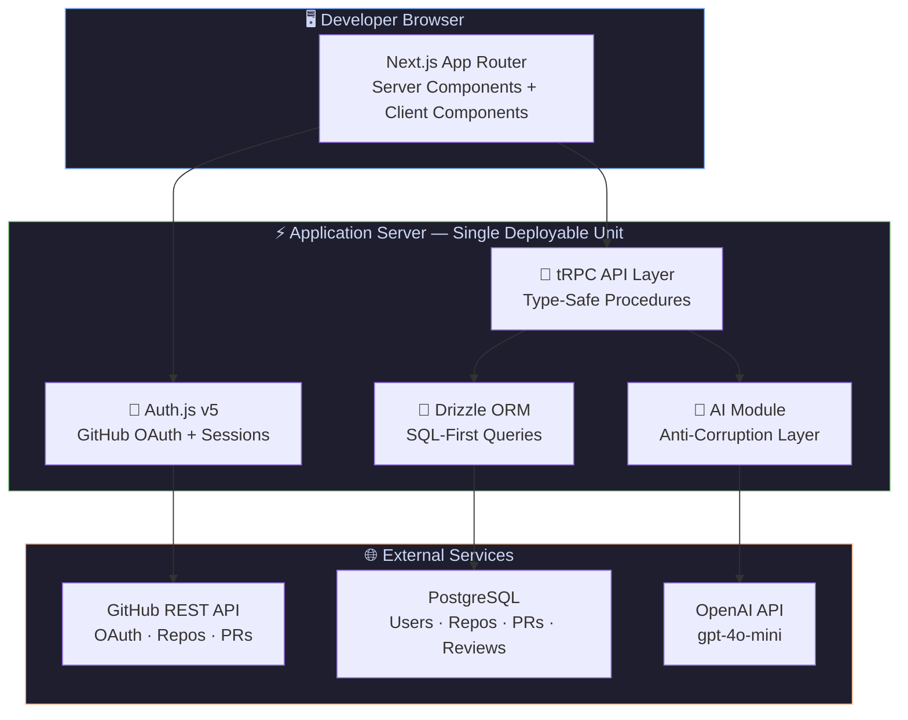
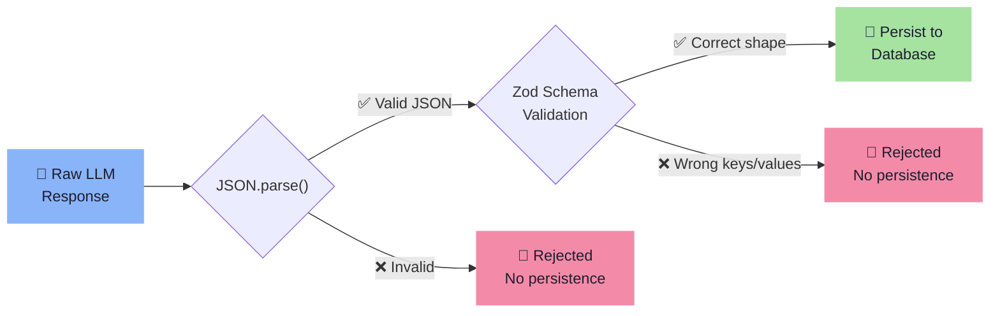
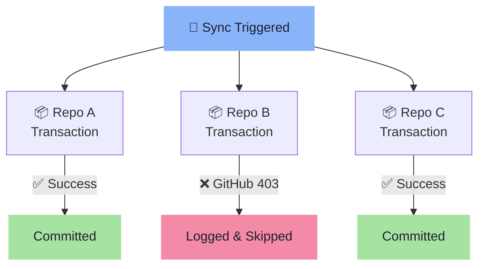
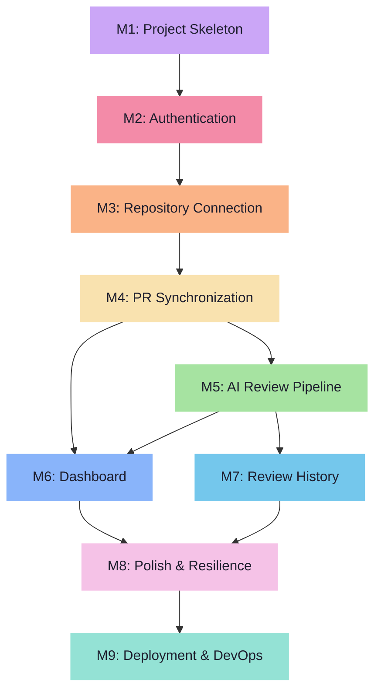

<div align="center">

# 🔀 MergeFlow

### AI-Powered Engineering Intelligence for Pull Requests

Structured summaries · Risk assessments · Immutable review history

[](https://nextjs.org/)
[](https://www.typescriptlang.org/)
[](https://www.postgresql.org/)
[](https://trpc.io/)
[](https://openai.com/)
[](https://www.docker.com/)

<br />

**MergeFlow reads your pull requests and tells you what changed, why it matters, and how dangerous it is — before you open the diff.**

[Getting Started](#-getting-started) · [Architecture](#-architecture-overview) · [How It Works](#-how-it-works) · [Engineering Decisions](#-engineering-decisions) · [Deployment](#-deployment)

---

</div>

## 🎯 The Problem

<table>
<tr>
<td width="50%">

### Without MergeFlow

❌ A 5-line auth middleware change looks identical to a 500-line UI refactor in the PR queue

❌ Engineers skim large PRs and rubber-stamp small ones under time pressure

❌ Critical changes in config files, migrations, and security logic get buried

❌ No structured way to track risk patterns across repositories

</td>
<td width="50%">

### With MergeFlow

✅ Every PR gets a categorical risk assessment: **Low**, **Medium**, **High**, or **Critical**

✅ Reviewers know exactly where to focus before opening the diff

✅ Immutable review history tracks how risk evolves over time

✅ Dashboard aggregates risk intelligence across all repositories

</td>
</tr>
</table>

---

## 🏗️ Architecture Overview



> [!NOTE]
> **Monolith by design (ADR-001).** All domain logic, API endpoints, and server-rendered UI live in a single deployable unit. Domain boundaries are strict enough that any module could become a service — but there's no reason to pay the operational cost of distribution for an MVP.

---

## 🔄 How It Works

The system implements a linear pipeline from authentication to dashboard analytics. Each stage was built as an independent **vertical slice** with its own schema, business logic, API endpoints, and UI.

```mermaid
graph LR
    A["🔐 <b>Step 1</b><br/>GitHub OAuth"] --> B["📂 <b>Step 2</b><br/>Discover Repos"]
    B --> C["🔗 <b>Step 3</b><br/>Connect Repos"]
    C --> D["🔄 <b>Step 4</b><br/>Sync PRs"]
    D --> E["🤖 <b>Step 5</b><br/>AI Analysis"]
    E --> F["💾 <b>Step 6</b><br/>Persist Review"]
    F --> G["📜 <b>Step 7</b><br/>Review History"]
    G --> H["📊 <b>Step 8</b><br/>Dashboard"]

    style A fill:#f38ba8,stroke:#f38ba8,color:#1e1e2e
    style B fill:#fab387,stroke:#fab387,color:#1e1e2e
    style C fill:#f9e2af,stroke:#f9e2af,color:#1e1e2e
    style D fill:#a6e3a1,stroke:#a6e3a1,color:#1e1e2e
    style E fill:#89b4fa,stroke:#89b4fa,color:#1e1e2e
    style F fill:#cba6f7,stroke:#cba6f7,color:#1e1e2e
    style G fill:#f5c2e7,stroke:#f5c2e7,color:#1e1e2e
    style H fill:#94e2d5,stroke:#94e2d5,color:#1e1e2e
```



<details>
<summary><b>🔐 Step 1 — GitHub OAuth Authentication</b></summary>
<br/>

The user signs in with GitHub. Auth.js handles the OAuth flow, persists user identity via the Drizzle adapter, and stores the GitHub access token in the database. The session is **server-side** (database-backed, not JWT), making it immediately revocable.

</details>

<details>
<summary><b>📂 Step 2 — Repository Discovery</b></summary>
<br/>

The server uses the stored access token to call `GET /user/repos` on the GitHub API. The response is merged with existing database records to display connection status alongside each repository.

</details>

<details>
<summary><b>🔗 Step 3 — Repository Connection</b></summary>
<br/>

The user selects repositories to monitor. Connection is an **idempotent UPSERT** — if a repository was previously disconnected, reconnecting it flips the `connection_status` back to `CONNECTED` without creating a duplicate.

</details>

<details>
<summary><b>🔄 Step 4 — Pull Request Synchronization</b></summary>
<br/>

The sync engine fetches open PRs and the last N closed/merged PRs for each connected repository. PRs are persisted using `ON CONFLICT DO UPDATE` keyed on `(repository_id, github_pr_number)`, making the operation **strictly idempotent**. Each repository is synced inside its own database transaction to isolate failure domains.

</details>

<details>
<summary><b>🤖 Step 5 — AI Review Generation</b></summary>
<br/>

The system loads the PR context, constructs a structured prompt, sends it to OpenAI, and receives a JSON response. The response is parsed with `JSON.parse`, then validated against a **Zod schema** that enforces the exact shape: `{ summary, riskLevel, riskReasoning, metadata }`. If validation fails, the review is rejected entirely — **no partial data is persisted**.

</details>

<details>
<summary><b>💾 Step 6 — Append-Only Persistence</b></summary>
<br/>

The validated review is inserted as a new row. The `reviews` table is **append-only by design**: no `UPDATE` operation, no `updatedAt` column, no `DELETE` path. Re-analyzing a PR always creates a new immutable record.

</details>

<details>
<summary><b>📜 Step 7 — Review History</b></summary>
<br/>

All reviews for a PR are returned in reverse chronological order. The latest review is visually highlighted. Because the table is append-only, "history" falls out of the schema naturally — it's not a feature that needed special engineering.

</details>

<details>
<summary><b>📊 Step 8 — Dashboard Analytics</b></summary>
<br/>

The dashboard aggregates metrics using **five parallel SQL queries** with `GROUP BY`, `COUNT`, and `JOIN`. No N+1 queries. The entire dashboard is a Next.js Server Component — **zero client-side JavaScript** is required to render it.

</details>

---

## 🧠 Engineering Decisions

### 📐 Specification-Driven Development

> [!IMPORTANT]
> **The architecture was frozen before implementation began.** Five documents define every domain boundary, entity lifecycle, and communication contract. Implementation followed the specification — design questions were looked up in the architecture, not improvised.

| Document | Purpose |
|---|---|
| [`00-project-overview.md`](docs/00-project-overview.md) | Vision, principles (P1–P9), constraints |
| [`01-product-specification.md`](docs/01-product-specification.md) | Functional requirements, user stories, invariants |
| [`02-domain-analysis.md`](docs/02-domain-analysis.md) | Bounded contexts, aggregates, domain rules |
| [`03-system-architecture.md`](docs/03-system-architecture.md) | C4 diagrams, sequence diagrams, ADRs |
| [`04-database-design.md`](docs/04-database-design.md) | ERD, table definitions, indexing strategy |
| [`IMPLEMENTATION_PLAN.md`](IMPLEMENTATION_PLAN.md) | 9 milestones with dependency graph |

### 🛡️ AI Anti-Corruption Layer

The AI module protects the domain from LLM unpredictability through strict interface contracts:

```
src/server/ai/
├── provider.ts    →  Interface: AIProvider { name, model, generateStructuredReview() }
├── openai.ts      →  Concrete: OpenAI REST API implementation
├── prompt.ts      →  Pure function: buildReviewPrompt(context) → string
├── schema.ts      →  Zod schema: ReviewResponseSchema
└── review.ts      →  Orchestrator: prompt → provider → parse → validate → DTO
```

> [!WARNING]
> **LLM responses are structurally unpredictable.** The model might return valid JSON with wrong keys, hallucinate enum values (`"MODERATE"` instead of `"MEDIUM"`), or wrap output in markdown code blocks. The Zod validation layer rejects anything that doesn't exactly match the expected shape. If validation fails, **no review is persisted**.

### 📊 Three-Layer AI Validation



### 🔒 Append-Only Reviews

> [!TIP]
> **Why not just `UPDATE` the review?** Pull requests evolve — new commits get pushed, branches get rebased. An AI review corresponds to a specific snapshot. Overwriting it destroys the audit trail. MergeFlow creates a **new immutable row** on every analysis. "Latest" is `ORDER BY created_at DESC LIMIT 1` hitting a composite index. History is the same query without the `LIMIT`.

### ⚡ Idempotent Sync with Transaction Isolation



Each repository syncs inside its own `db.transaction()`. If Repo B fails, Repos A and C are unaffected. The result DTO reports: `{ syncedRepositories, inserted, updated, failedRepositories, durationMs }`.

---

## ⚙️ Tech Stack

<table>
<tr>
<td align="center" width="110">

<br /><b>Next.js 15</b>
<br /><sub>App Router + RSC</sub>
</td>
<td align="center" width="110">

<br /><b>TypeScript</b>
<br /><sub>Strict Mode</sub>
</td>
<td align="center" width="110">

<br /><b>PostgreSQL</b>
<br /><sub>Primary DB</sub>
</td>
<td align="center" width="110">

<br /><b>React 19</b>
<br /><sub>Server Components</sub>
</td>
<td align="center" width="110">

<br /><b>Docker</b>
<br /><sub>Multi-stage Build</sub>
</td>
</tr>
<tr>
<td align="center" width="110">
<br /><b>tRPC</b>
<br /><sub>Type-safe API</sub>
</td>
<td align="center" width="110">
<br /><b>Drizzle ORM</b>
<br /><sub>SQL-first Toolkit</sub>
</td>
<td align="center" width="110">
<br /><b>Auth.js v5</b>
<br /><sub>GitHub OAuth</sub>
</td>
<td align="center" width="110">
<br /><b>Zod</b>
<br /><sub>Schema Validation</sub>
</td>
<td align="center" width="110">
<br /><b>OpenAI</b>
<br /><sub>gpt-4o-mini</sub>
</td>
</tr>
</table>

---

## 📁 Project Structure

```
src/
├── app/                              # Next.js App Router
│   ├── page.tsx                      # Landing page with OAuth sign-in
│   ├── dashboard/
│   │   ├── page.tsx                  # 📊 Main dashboard (Server Component)
│   │   ├── repositories/            # 📂 Repository management UI
│   │   └── reviews/[pullRequestId]/ # 📜 Review history timeline
│   └── api/                         # Auth and tRPC route handlers
│
├── server/
│   ├── ai/                          # 🤖 AI domain module
│   │   ├── provider.ts              # Interface contract
│   │   ├── openai.ts                # OpenAI implementation
│   │   ├── prompt.ts                # Prompt construction
│   │   ├── schema.ts                # Zod output validation
│   │   └── review.ts                # Orchestration layer
│   │
│   ├── api/routers/
│   │   ├── repository.ts            # 🔗 GitHub integration + connection management
│   │   ├── pull-request.ts          # 🔄 Sync engine with idempotent upserts
│   │   ├── review.ts                # 🛡️ AI generation + append-only persistence
│   │   └── dashboard.ts             # 📊 Aggregation queries (no N+1)
│   │
│   ├── auth/                        # 🔐 Auth.js configuration
│   └── db/schema.ts                 # 💾 Drizzle schema (all domain tables)
│
docs/                                 # 📐 Frozen architecture (5 documents)
IMPLEMENTATION_PLAN.md                # 🗺️ 9-milestone roadmap
```

---

## 🚀 Getting Started

### Prerequisites

| Requirement | Version | Purpose |
|---|---|---|
| Node.js | 20+ | Runtime |
| PostgreSQL | 16+ | Database (or use `start-database.sh` for Docker) |
| GitHub OAuth App | — | [Create one here](https://github.com/settings/developers) |
| OpenAI API Key | — | AI review generation |

### Quick Start

```bash
# Clone and install
git clone https://github.com/sankar-chaitanya2025/MergeFlow.git
cd MergeFlow
npm install

# Configure environment
cp .env.example .env
# Edit .env with your credentials (see table below)

# Setup database and launch
npx drizzle-kit push
npm run dev
```

Then navigate to `http://localhost:3000` → Sign in with GitHub → Connect a repo → Sync PRs → Trigger AI review.

### Environment Variables

| Variable | Required | Description |
|---|---|---|
| `DATABASE_URL` | ✅ | PostgreSQL connection string. Use pooled connection in serverless. |
| `AUTH_SECRET` | 🔶 Production | Session encryption key. Generate: `npx auth secret` |
| `AUTH_GITHUB_ID` | ✅ | GitHub OAuth App Client ID |
| `AUTH_GITHUB_SECRET` | ✅ | GitHub OAuth App Client Secret |
| `OPENAI_API_KEY` | ✅ | OpenAI API key for review generation |

> [!CAUTION]
> All variables are validated at build time via Zod in `src/env.js`. Missing or malformed values **fail the build immediately**. No silent runtime failures.

---

## 🐳 Deployment

### Docker

```bash
docker build -t mergeflow .
docker run -p 3000:3000 --env-file .env mergeflow
```

> [!NOTE]
> The Dockerfile uses a **three-stage build**: `deps` → `builder` → `runner`. Final image runs as a non-root user on Alpine Linux with Next.js standalone output (~150MB).

### Vercel

The project deploys to Vercel out of the box (`output: "standalone"` in `next.config.js`). Add all environment variables in the Vercel dashboard.

> [!WARNING]
> The `generateReview` mutation calls OpenAI (5–15s). Vercel's Hobby plan has a 10s timeout. You may need Pro for `maxDuration: 60`.

### CI/CD Pipeline


---

## 🧩 Challenges & Solutions

<details>
<summary><b>🎲 Validating Stochastic AI Output</b></summary>
<br/>

**Problem:** LLMs are non-deterministic. Even with `response_format: json_object` and `temperature: 0.2`, the model can invent keys, hallucinate enum values, or wrap JSON in markdown.

**Solution:** Three-layer validation — `JSON.parse()` catches syntax errors, `ReviewResponseSchema.safeParse()` catches structural mismatches, and domain invariant DI-V4 ensures no malformed data ever reaches the database.

**Lesson:** Treat LLM output like untrusted user input. The validation layer is the engineering boundary that makes the system reliable.

</details>

<details>
<summary><b>🔀 Per-Repository Transaction Isolation</b></summary>
<br/>

**Problem:** If syncing Repo A succeeds but Repo B fails (rate limit, revoked access), a single transaction would roll back everything.

**Solution:** Each repository syncs inside its own `db.transaction()` block. Failures are logged and skipped. The sync result reports inserted/updated counts and a list of failed repositories with error messages.

</details>

<details>
<summary><b>📊 Dashboard Aggregation Without N+1</b></summary>
<br/>

**Problem:** The dashboard spans 4 tables deep: users → repositories → pull requests → reviews. Naive implementation: 2,000+ queries for 20 repos × 100 PRs.

**Solution:** Five parallel SQL queries via `Promise.all()`, each using `INNER JOIN`, `GROUP BY`, and `COUNT(DISTINCT ...)`. The dashboard loads with **exactly 5 database round trips** regardless of data volume.

</details>

<details>
<summary><b>🔐 Authorization Without RBAC</b></summary>
<br/>

**Problem:** The `reviews` table has no `user_id`. How to prevent User A from reading User B's reviews?

**Solution:** Authorization traverses the ownership chain: load the pull request → load its parent repository → check `pr.repository.userId === ctx.session.user.id`. Avoids denormalizing `user_id` across every table.

</details>

---

## 🔮 Future Improvements

| Improvement | Impact | Architecture Support |
|---|---|---|
| **Real diff fetching** | 🔴 Critical | Fetch from `GET /repos/{owner}/{repo}/pulls/{number}.diff` |
| **Background jobs** | 🟠 High | `jobs` table already exists (ADR-007) |
| **GitHub webhooks** | 🟠 High | Sync engine is trigger-agnostic (ADR-006) |
| **Rate limit awareness** | 🟡 Medium | Track `X-RateLimit-Remaining` headers |
| **Multi-provider AI** | 🟡 Medium | `AIProvider` interface supports new implementations |

---

## 💡 Engineering Lessons

> **SDD works for solo developers.** Frozen architecture documents eliminated the most expensive engineering time: deciding what to build while building it.

> **Append-only tables simplify more than they complicate.** Slightly more complex "latest" queries, but zero lost history, zero race conditions, zero audit trail reconstruction.

> **Zod at trust boundaries is non-negotiable.** Browser → server, GitHub → server, AI → server, server → database. One library, four boundaries.

---

## 📊 Development Journey



> **30 commits** · **9 milestones** · **5 frozen architecture documents** · **31 source files** · **1 deployable unit**

---

## 📄 License

MIT

---

<div align="center">

*Built with the [T3 Stack](https://create.t3.gg/) — Next.js · tRPC · Drizzle · Auth.js · Tailwind CSS*

**Designed using Specification-Driven Development**

</div>
