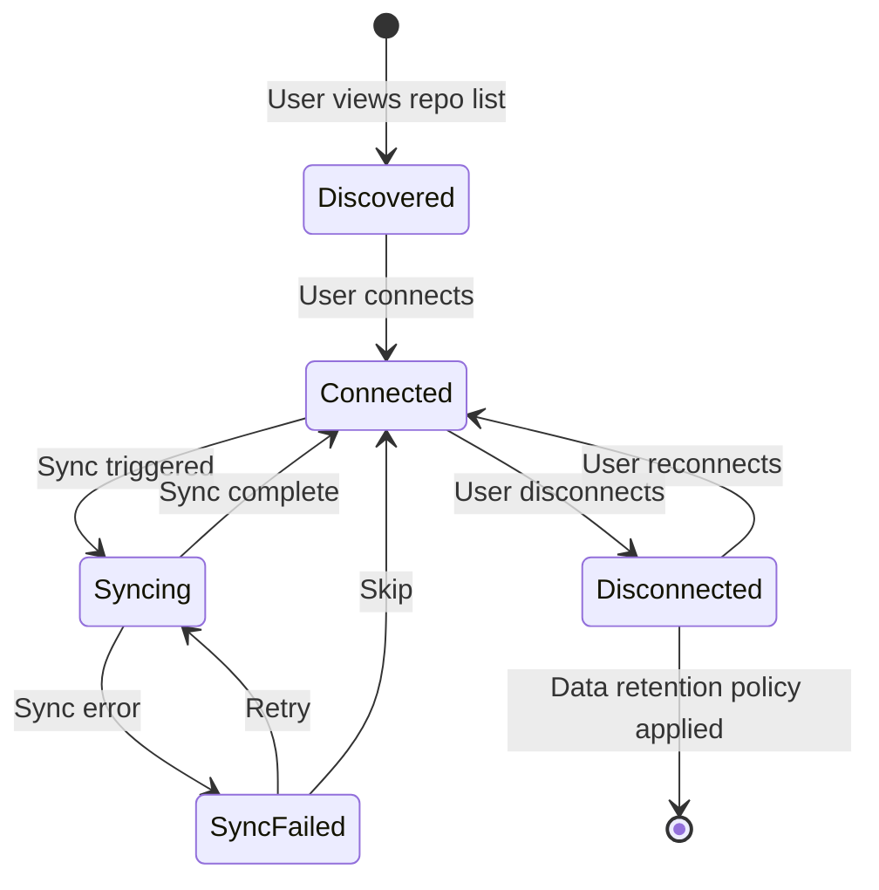
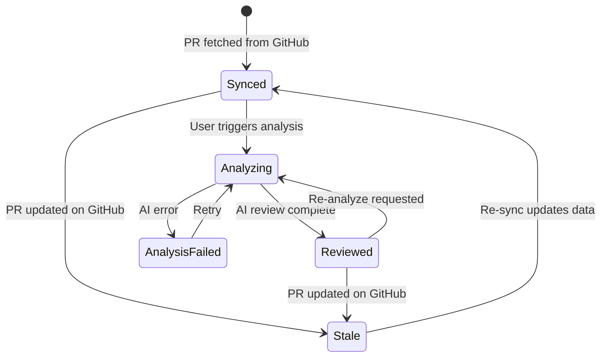
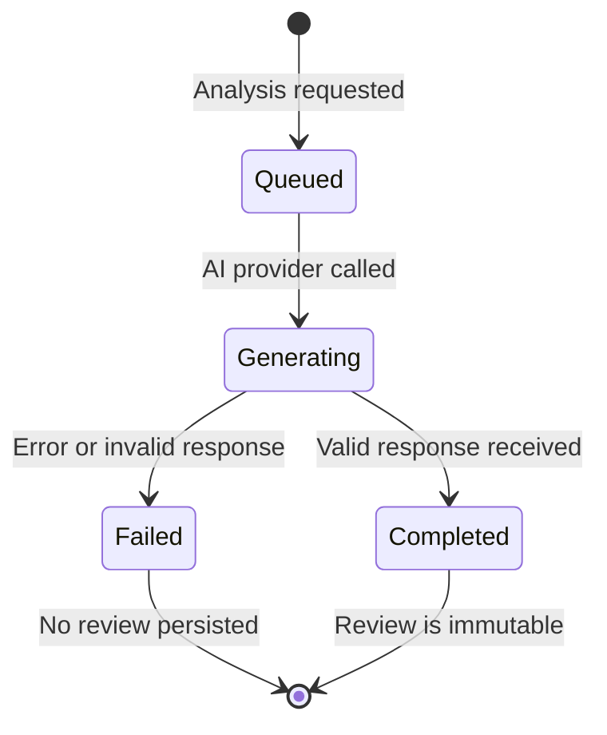
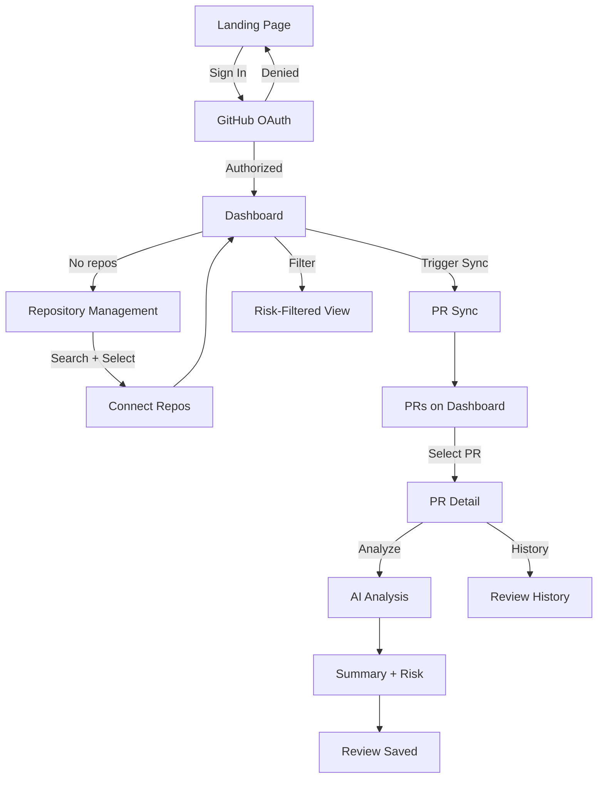

# MergeFlow — Product Specification

> **Status:** Final | **Created:** 2026-07-05 | **Document ID:** `docs/01-product-specification.md`
> **References:** [`00-project-overview.md`](./00-project-overview.md)

---

## 1. Purpose

Translates the vision in `00-project-overview.md` into precise, testable
product requirements with priorities, domain ownership, state machines,
failure scenarios, and acceptance criteria.

## 2. Scope

**Covered:** Functional requirements (user-facing and system), non-functional
requirements, business rules, entity lifecycles, user stories, design decisions.

**Excluded:** System architecture, database schema, API contracts, AI methodology,
security design — each covered in their respective documents.

## 3. Design Goals

- Every requirement is testable and has measurable success criteria
- Every requirement has a priority (MoSCoW) and domain owner
- Every entity has a defined lifecycle (state machine)
- Every failure scenario is explicitly handled
- All terminology references the glossary

---

## 4. Product Invariants

Rules that must always hold true. Violation requires an ADR revision.

| ID | Invariant |
|----|-----------|
| INV-1 | MergeFlow never modifies source code. Read-only access only. |
| INV-2 | MergeFlow never merges pull requests. |
| INV-3 | MergeFlow never performs destructive GitHub actions. |
| INV-4 | AI recommendations are advisory only. No automated actions. |
| INV-5 | Every AI *review* is traceable to a specific *PR*, timestamp, and *AI provider*. |
| INV-6 | Users retain control over all workflows. AI analysis requires explicit user action. |
| INV-7 | *Repository* data belongs only to the authenticated *user*. No cross-user visibility. |
| INV-8 | AI *reviews* are immutable once created. |

*Italicized terms are defined in §17 (Glossary).*

---

## 5. Business Rules

Domain truths that are independent of implementation.

| ID | Rule | Domain |
|----|------|--------|
| BR-1 | A *repository* cannot be analyzed unless it is *connected*. | Repository |
| BR-2 | A *review* cannot exist without a *pull request*. | Review |
| BR-3 | A *pull request* belongs to exactly one *repository*. | Pull Request |
| BR-4 | Every *review* is immutable. Re-analysis creates a new review. | Review |
| BR-5 | *Repository* ownership is determined solely by GitHub permissions. | Repository |
| BR-6 | A *disconnected* repository cannot receive new *reviews*. | Repository |
| BR-7 | A *user* can only access data from repositories they have GitHub access to. | Authentication |
| BR-8 | AI analysis requires an explicit user trigger in the MVP. | Review |
| BR-9 | A *pull request* can have zero or many *reviews*. | Pull Request |
| BR-10 | *Sync policy* parameters do not affect existing persisted data. | Pull Request |

---

## 6. Goals and Non-Goals

### Goals

| ID | Goal |
|----|------|
| G1 | Reduce context-switching cost for code reviewers |
| G2 | Surface engineering risk before review begins |
| G3 | Build structured, immutable review history |
| G4 | Minimize onboarding friction (sign-in → first review < 5 min) |
| G5 | Maintain architectural extensibility per `00-project-overview.md` §5 |

### Non-Goals

Code generation, merge automation, CI/CD, issue tracking, team collaboration,
notifications, billing, enterprise RBAC/SSO, multi-agent AI, RAG/vector databases.
Full list in `00-project-overview.md` §8.

---

## 7. User-Facing Functional Requirements

These describe behavior visible to the user.

### UFR-1: Authenticate with GitHub

| Attribute | Detail |
|-----------|--------|
| **Domain** | Authentication |
| **Priority** | Must Have |
| **Trigger** | User clicks "Sign in with GitHub" |
| **Behavior** | OAuth redirect → authorize → create/update user → establish session |
| **Success Criteria** | ① OAuth flow completes. ② User record persisted. ③ Session established. ④ Username + avatar displayed. ⑤ Duplicate sign-in reuses existing user record. |
| **Failure Scenarios** | OAuth denied → return to landing with message. GitHub down → display error, allow retry. Token exchange fails → display error, no partial session created. |
| **Glossary** | *User*, *Session* |

### UFR-2: View Accessible Repositories

| Attribute | Detail |
|-----------|--------|
| **Domain** | Repository |
| **Priority** | Must Have |
| **Trigger** | User navigates to repository management |
| **Behavior** | Fetch repos from GitHub. Display searchable list with name, owner, visibility, language. Distinguish connected from unconnected. |
| **Success Criteria** | ① All accessible repos displayed. ② Search filters by name. ③ Connected repos visually distinct. ④ Loads in < 5 seconds. |
| **Failure Scenarios** | Token expired → prompt re-auth. Rate limited → show message + retry. Zero repos → empty state with guidance. |
| **Glossary** | *Repository*, *Connected* |

### UFR-3: Connect Repository

| Attribute | Detail |
|-----------|--------|
| **Domain** | Repository |
| **Priority** | Must Have |
| **Trigger** | User selects repos and confirms |
| **Behavior** | Persist as *connected*. Available for sync. No auto-sync on connect. |
| **Success Criteria** | ① Selected repos appear as connected. ② Persists across sessions. ③ Duplicate connections prevented. ④ No PRs synced automatically (BR-8). |
| **Failure Scenarios** | Repo no longer accessible → error message, skip that repo. Partial selection failure → connect successes, report failures. |
| **Glossary** | *Repository*, *Connected* |

### UFR-4: Disconnect Repository

| Attribute | Detail |
|-----------|--------|
| **Domain** | Repository |
| **Priority** | Must Have |
| **Trigger** | User chooses to disconnect |
| **Behavior** | Mark as *disconnected*. Stop future sync. No new reviews (BR-6). |
| **Success Criteria** | ① Repo no longer shown as connected. ② No new syncs occur. ③ Action is reversible (can reconnect). |
| **Failure Scenarios** | None expected — local operation. |
| **Open Question** | OQ-1: Retain or delete existing PR data/reviews? → `04-database-design.md` |
| **Glossary** | *Repository*, *Disconnected* |

### UFR-5: Trigger Pull Request Sync

| Attribute | Detail |
|-----------|--------|
| **Domain** | Pull Request |
| **Priority** | Must Have |
| **Trigger** | User manually triggers sync |
| **Behavior** | Fetch PRs per *sync policy* (all open + last N merged, default N=30). Create/update PR records. |
| **Success Criteria** | ① Open PRs fetched. ② Last N merged PRs fetched. ③ PR metadata correct. ④ Completes in < 60s for ≤ 20 repos. ⑤ No AI analysis triggered (INV-6). |
| **Failure Scenarios** | Rate limited → partial sync, report progress, allow retry. Repo access revoked → mark disconnected, notify user. GitHub down → error message, retry. |
| **Glossary** | *Pull Request*, *Sync Policy*, *Repository* |

### UFR-6: Request AI Analysis

| Attribute | Detail |
|-----------|--------|
| **Domain** | Review |
| **Priority** | Must Have |
| **Trigger** | User clicks "Analyze" on a specific PR |
| **Behavior** | Send PR data + diff to AI provider. Generate *summary* + *risk level*. Persist as immutable *review*. |
| **Success Criteria** | ① Analysis completes in < 30s. ② Summary + risk displayed. ③ Review persisted with timestamp + provider. ④ Appears in review history. ⑤ Re-analyzing creates a new review (BR-4). |
| **Failure Scenarios** | AI provider down → error message, allow retry. No partial review saved on failure. Diff too large → see OQ-2 in `08-ai-system.md`. Rate limited by AI provider → queue/retry behavior TBD. |
| **Glossary** | *Review*, *Summary*, *Risk Level*, *AI Provider* |

### UFR-7: View AI Review

| Attribute | Detail |
|-----------|--------|
| **Domain** | Review |
| **Priority** | Must Have |
| **Trigger** | User views PR detail page |
| **Behavior** | Display most recent *review*: summary, risk level, reasoning, timestamp, provider. |
| **Success Criteria** | ① Latest review shown by default. ② Risk level has visual indicator. ③ Reasoning is visible. ④ Timestamp + provider shown. |
| **Failure Scenarios** | No review exists → show "Not analyzed" with analyze CTA. |
| **Glossary** | *Review*, *Summary*, *Risk Level* |

### UFR-8: View Review History

| Attribute | Detail |
|-----------|--------|
| **Domain** | Review |
| **Priority** | Should Have |
| **Trigger** | User views history section on PR detail page |
| **Behavior** | Display all *reviews* for this PR, newest first. |
| **Success Criteria** | ① All reviews listed chronologically. ② Each shows summary, risk, timestamp. ③ Old reviews unmodified (INV-8). |
| **Failure Scenarios** | No reviews → empty state message. |
| **Glossary** | *Review*, *Review History* |

### UFR-9: View Dashboard

| Attribute | Detail |
|-----------|--------|
| **Domain** | Dashboard |
| **Priority** | Must Have |
| **Trigger** | User navigates to dashboard |
| **Behavior** | Show connected repos + PRs. Filter/group by risk level. Summary previews. Sync status. |
| **Success Criteria** | ① All connected repos visible. ② PRs filterable by risk. ③ "Not analyzed" shown for PRs without reviews. ④ Loads in < 2s. ⑤ Only authenticated user's data (INV-7). |
| **Failure Scenarios** | No repos connected → guide to repo management. No PRs synced → guide to sync. |
| **Glossary** | *Dashboard*, *Risk Level*, *Repository* |

### UFR-10: Re-Sync Pull Requests

| Attribute | Detail |
|-----------|--------|
| **Domain** | Pull Request |
| **Priority** | Should Have |
| **Trigger** | User triggers refresh |
| **Behavior** | Re-run sync policy. Update PR records. Existing reviews unaffected. |
| **Success Criteria** | ① PRs updated to latest GitHub state. ② New PRs added. ③ Existing reviews preserved. |
| **Failure Scenarios** | Same as UFR-5. |
| **Glossary** | *Pull Request*, *Sync Policy* |

---

## 8. System Functional Requirements

These describe internal system behavior not directly visible to users.

### SFR-1: Persist User Identity

| Attribute | Detail |
|-----------|--------|
| **Domain** | Authentication |
| **Priority** | Must Have |
| **Behavior** | Store GitHub ID, username, avatar URL, email on first auth. Update on subsequent logins. |
| **Success Criteria** | ① User record created on first login. ② Updated on re-login. ③ GitHub ID is the unique identifier. |

### SFR-2: Manage GitHub OAuth Tokens

| Attribute | Detail |
|-----------|--------|
| **Domain** | Authentication |
| **Priority** | Must Have |
| **Behavior** | Store access token encrypted at rest. Use for GitHub API calls. Handle expiration. |
| **Success Criteria** | ① Token never exposed to client. ② Encrypted in database. ③ Expiration handled gracefully. |
| **Failure Scenarios** | Token expired → prompt re-authentication. |

### SFR-3: Persist Repository Connections

| Attribute | Detail |
|-----------|--------|
| **Domain** | Repository |
| **Priority** | Must Have |
| **Behavior** | Store repo metadata (GitHub ID, name, owner, URL, visibility). Track connection status. |
| **Success Criteria** | ① Connection state persists across sessions. ② Metadata matches GitHub. |

### SFR-4: Execute PR Synchronization

| Attribute | Detail |
|-----------|--------|
| **Domain** | Pull Request |
| **Priority** | Must Have |
| **Behavior** | Fetch PRs from GitHub API per sync policy. Upsert into database. Idempotent. |
| **Success Criteria** | ① Running sync twice produces the same result. ② Partial failures don't corrupt existing data. |
| **Failure Scenarios** | Rate limited → pause, resume. Network error → retry with backoff. |

### SFR-5: Execute AI Analysis Pipeline

| Attribute | Detail |
|-----------|--------|
| **Domain** | Review |
| **Priority** | Must Have |
| **Behavior** | Construct prompt with PR data. Call AI provider. Parse structured response. Validate output. Persist review. |
| **Success Criteria** | ① Output contains summary + risk level. ② Output is validated before persistence. ③ Provider is recorded. |
| **Failure Scenarios** | Invalid AI response → reject, return error. Provider timeout → error, allow retry. |

### SFR-6: Persist AI Reviews

| Attribute | Detail |
|-----------|--------|
| **Domain** | Review |
| **Priority** | Must Have |
| **Behavior** | Store reviews as append-only records. Never update or delete. |
| **Success Criteria** | ① Reviews immutable after creation. ② Multiple reviews per PR supported. ③ Traceable (INV-5). |

### SFR-7: Maintain Auditability

| Attribute | Detail |
|-----------|--------|
| **Domain** | Review |
| **Priority** | Should Have |
| **Behavior** | Every review records: PR reference, timestamp, AI provider, model version. |
| **Success Criteria** | ① Any review can be traced to its source PR and AI provider. |

### SFR-8: Enforce Sync Policy

| Attribute | Detail |
|-----------|--------|
| **Domain** | Pull Request |
| **Priority** | Must Have |
| **Behavior** | Apply configurable sync policy (open PRs + last N merged). N is a product parameter (default 30). |
| **Success Criteria** | ① Only PRs matching policy are synced. ② Changing N does not affect existing data (BR-10). |

---

## 9. Non-Functional Requirements

### 9.1 Performance

| Metric | Target | Priority |
|--------|--------|----------|
| Dashboard load | < 2 seconds | Must Have |
| AI review generation | < 30 seconds | Must Have |
| Repository listing | < 5 seconds | Must Have |
| PR sync (≤ 20 repos) | < 60 seconds | Should Have |

### 9.2 Reliability

| Requirement | Priority |
|-------------|----------|
| PR data matches GitHub within one sync cycle | Must Have |
| AI failure does not block sync, dashboard, or history | Must Have |
| Failed syncs retryable without side effects (idempotent) | Must Have |

### 9.3 Security

| Requirement | Priority |
|-------------|----------|
| GitHub OAuth only. No email/password. | Must Have |
| Tokens encrypted at rest, never exposed to client | Must Have |
| Users see only their own data (INV-7) | Must Have |
| HTTPS for all external communication | Must Have |
| Read-only GitHub permissions (INV-1, INV-2, INV-3) | Must Have |

### 9.4 Capacity (MVP)

| Dimension | Target |
|-----------|--------|
| Repos per user | Up to 50 |
| PRs per repo | Up to 100 |
| Total PRs per user | Up to 5,000 |
| Reviews per PR | Unlimited (append-only) |

---

## 10. Entity Lifecycles

### 10.1 Repository Lifecycle

| State | Description |
|-------|-------------|
| **Discovered** | Fetched from GitHub. Not yet connected. Transient (not persisted). |
| **Connected** | User has linked this repo. Eligible for sync. |
| **Syncing** | Actively fetching PR data from GitHub. |
| **SyncFailed** | Sync encountered an error. Retryable. |
| **Disconnected** | User unlinked. No new syncs or reviews. |

### 10.2 Pull Request Lifecycle

| State | Description |
|-------|-------------|
| **Synced** | PR data fetched. No AI review yet. |
| **Analyzing** | AI analysis in progress. |
| **Reviewed** | At least one AI review exists. |
| **AnalysisFailed** | AI analysis failed. Retryable. |
| **Stale** | PR has changed on GitHub since last sync. |

### 10.3 Review Lifecycle

| State | Description |
|-------|-------------|
| **Queued** | Analysis requested, not yet sent to AI. |
| **Generating** | Waiting for AI provider response. |
| **Completed** | Review persisted. Immutable (INV-8). |
| **Failed** | AI call failed. No review saved. Can retry (creates new lifecycle). |

---

## 11. User Stories

### US-1: Sign In
> As a developer, I want to sign in with GitHub so I don't need a separate account.

**Criteria:** ① "Sign in with GitHub" on landing. ② Redirects to OAuth. ③ Success → dashboard. ④ Denied → landing with message. ⑤ Username + avatar shown.

### US-2: View Repositories
> As a developer, I want to see my GitHub repos to choose which to connect.

**Criteria:** ① All accessible repos shown. ② Searchable by name. ③ Connected repos distinguished. ④ Shows name, owner, visibility, language.

### US-3: Connect Repository
> As a developer, I want to connect repos so MergeFlow tracks their PRs.

**Criteria:** ① Select one or more repos. ② Appear as connected. ③ Persist across sessions. ④ No duplicate connections. ⑤ No auto-sync.

### US-4: Disconnect Repository
> As a developer, I want to disconnect a repo to stop tracking.

**Criteria:** ① Repo no longer active. ② No new syncs. ③ Reconnection possible.

### US-5: Sync Pull Requests
> As a developer, I want to sync PRs to see latest activity.

**Criteria:** ① Manual trigger. ② Open + last N merged fetched. ③ Metadata correct. ④ Progress indicated. ⑤ Partial failure preserves successful data.

### US-6: Request AI Analysis
> As a developer, I want AI analysis so I understand a PR before reviewing code.

**Criteria:** ① "Analyze" action on each PR. ② Loading state shown. ③ Summary + risk on completion. ④ Review persisted. ⑤ Failure → error + retry.

### US-7: View AI Review
> As a developer, I want to read the summary and risk assessment.

**Criteria:** ① Latest review shown. ② Summary describes changes + intent. ③ Risk level visual indicator. ④ Reasoning visible. ⑤ "Not analyzed" if none.

### US-8: View Review History
> As a developer, I want to see past reviews to track how analysis changed.

**Criteria:** ① All reviews listed, newest first. ② Each shows summary, risk, timestamp. ③ Old reviews unmodified.

### US-9: View Dashboard
> As a developer, I want a dashboard of PRs organized by risk to prioritize reviews.

**Criteria:** ① All PRs from connected repos. ② Filter/group by risk. ③ "Not analyzed" for unreviewed PRs. ④ Summary previews. ⑤ Loads in < 2s.

### US-10: Re-Sync
> As a developer, I want to refresh PR data to see latest GitHub state.

**Criteria:** ① Re-sync per repo or all. ② PRs updated. ③ Reviews unaffected. ④ New PRs added.

---

## 12. Design Decisions

### DD-1: Manual AI Trigger

| | |
|--|--|
| **Context** | AI calls cost money. Not every PR needs analysis. |
| **Decision** | Manual trigger in MVP. |
| **Alternatives** | Automatic on sync (higher cost, better UX). Configurable (more complexity). |
| **Consequences** | Dashboard shows "not analyzed" PRs. Analyze CTA must be prominent. |
| **Reversible?** | Yes. Auto-trigger is an additive change. |
| **Principles** | P2, P3, P6 |

### DD-2: Synchronization Policy

| | |
|--|--|
| **Context** | Syncing all PRs is wasteful. Users care about active work. |
| **Decision** | Open PRs + last N merged (N=30, configurable parameter). |
| **Alternatives** | Open only (no history). All PRs (too much data). Time-based (unfair across repos). |
| **Consequences** | Sync module supports parameterized policies. |
| **Reversible?** | Yes. N is a parameter. |
| **Principles** | P3, P6 |

### DD-3: Explicit Repository Selection

| | |
|--|--|
| **Context** | Users choose which repos to monitor. |
| **Decision** | Searchable list, explicit individual selection. No bulk import. |
| **Alternatives** | Auto-import all (accidental connections). One-at-a-time (tedious). |
| **Consequences** | Repo listing needs search. Connection API accepts list of IDs. |
| **Reversible?** | Yes. Bulk select is a UI addition. |
| **Principles** | P3, P8 |

### DD-4: Immutable Reviews

| | |
|--|--|
| **Context** | PRs may be analyzed multiple times. |
| **Decision** | Append-only. New analysis creates new review. Old reviews never modified. |
| **Alternatives** | Overwrite (loses history). Versioned with pointer (more complex). |
| **Consequences** | Schema supports multiple reviews per PR. UI shows latest + history. |
| **Reversible?** | Partially. Overwrite→append is easy. Append→overwrite loses data. |
| **Principles** | P6 |

---

## 13. Constraints

All constraints from `00-project-overview.md` §9 (C1–C8) apply, plus:

| ID | Constraint |
|----|-----------|
| PC-1 | AI analysis requires full PR diff from GitHub. |
| PC-2 | Sync policy parameter (N) must have a sensible default. |
| PC-3 | Dashboard must function with zero analyzed PRs (empty states). |
| PC-4 | Session/token strategy defined in `10-security.md`. |

---

## 14. Open Questions

| ID | Question | Domain | Resolved In |
|----|----------|--------|-------------|
| OQ-1 | Retain or delete PR data on repo disconnect? | Repository | `04-database-design.md` |
| OQ-2 | Handle diffs exceeding AI context window? | Review | `08-ai-system.md` |
| OQ-3 | Archive or keep stale PRs on re-sync? | Pull Request | `07-github-integration.md` |
| OQ-4 | Required GitHub OAuth scopes? | Authentication | `07-github-integration.md` |
| OQ-5 | Is N user-configurable in UI or config-only? | Pull Request | `03-system-architecture.md` |

---

## 15. User Flow Diagram

---

## 16. Requirements Traceability

> **Note:** System Functional Requirements (SFRs) do not map directly to user
> stories. They support User-Facing Requirements (UFRs), which in turn map to
> stories. The "Supports" column traces this indirect relationship.

| Requirement | Type | Domain | Priority | Features | Stories | Supports | Invariants | Business Rules |
|-------------|------|--------|----------|----------|---------|----------|------------|---------------|
| UFR-1 | User | Auth | Must | F1 | US-1 | — | INV-7 | BR-7 |
| UFR-2 | User | Repo | Must | F2 | US-2 | — | INV-7 | BR-5 |
| UFR-3 | User | Repo | Must | F2 | US-3 | — | — | BR-1 |
| UFR-4 | User | Repo | Must | F2 | US-4 | — | — | BR-6 |
| UFR-5 | User | PR | Must | F3 | US-5 | — | INV-1,6 | BR-8 |
| UFR-6 | User | Review | Must | F4,F5 | US-6 | — | INV-4,5,8 | BR-1,2,4,8 |
| UFR-7 | User | Review | Must | F4,F5 | US-7 | — | INV-4,5 | BR-2 |
| UFR-8 | User | Review | Should | F6 | US-8 | — | INV-5,8 | BR-4,9 |
| UFR-9 | User | Dashboard | Must | F7 | US-9 | — | INV-7 | BR-7 |
| UFR-10 | User | PR | Should | F3 | US-10 | — | INV-1 | BR-10 |
| SFR-1 | System | Auth | Must | F1 | — | UFR-1 | INV-7 | BR-7 |
| SFR-2 | System | Auth | Must | F1 | — | UFR-1,2,5 | INV-2,3 | — |
| SFR-3 | System | Repo | Must | F2 | — | UFR-3,4 | — | BR-1,5 |
| SFR-4 | System | PR | Must | F3 | — | UFR-5,10 | INV-1,2,3 | BR-3 |
| SFR-5 | System | Review | Must | F4,F5 | — | UFR-6 | INV-4,5 | BR-2,4 |
| SFR-6 | System | Review | Must | F6 | — | UFR-6,7,8 | INV-8 | BR-4,9 |
| SFR-7 | System | Review | Should | F6 | — | UFR-7,8 | INV-5 | — |
| SFR-8 | System | PR | Must | F3 | — | UFR-5,10 | — | BR-10 |

---

## 17. Glossary

Extends the glossary from `00-project-overview.md` §15.

| Term | Definition |
|------|------------|
| **User** | An authenticated individual identified by their GitHub account. |
| **Session** | An authenticated period during which a user can interact with MergeFlow. |
| **Repository** | A GitHub repository that a user has read access to. |
| **Connected** | A repository state indicating it is linked to MergeFlow for synchronization. |
| **Disconnected** | A repository state indicating it is no longer monitored. |
| **Pull Request (PR)** | A GitHub PR synchronized into MergeFlow. |
| **Sync Policy** | The rule governing which PRs are fetched (open + last N merged). |
| **Review** | An immutable AI-generated analysis containing a summary and risk level. |
| **Review History** | The ordered collection of all reviews for a given PR. |
| **Summary** | The AI-generated description of what a PR does. |
| **Risk Level** | Categorical assessment: Low / Medium / High / Critical. |
| **AI Provider** | The external AI service used to generate reviews. |
| **Dashboard** | The primary working surface showing PRs organized by risk. |
| **Stale** | A PR whose data may have changed on GitHub since last sync. |

---

## 18. References

| Document | Relevance |
|----------|-----------|
| [`00-project-overview.md`](./00-project-overview.md) | Vision, principles, constraints, assumptions |
| [`03-system-architecture.md`](./03-system-architecture.md) | Resolves sync strategy, component boundaries |
| [`04-database-design.md`](./04-database-design.md) | Resolves data retention (OQ-1) |
| [`07-github-integration.md`](./07-github-integration.md) | Resolves OAuth scopes, sync behavior (OQ-3, OQ-4) |
| [`08-ai-system.md`](./08-ai-system.md) | Resolves risk methodology, context limits (OQ-2) |
| [`10-security.md`](./10-security.md) | Resolves session management (PC-4) |

---

*Next document: [`docs/02-requirements.md`](./02-requirements.md)*
