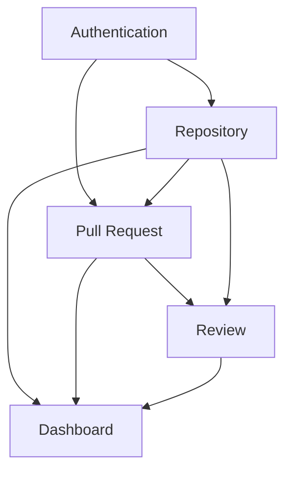
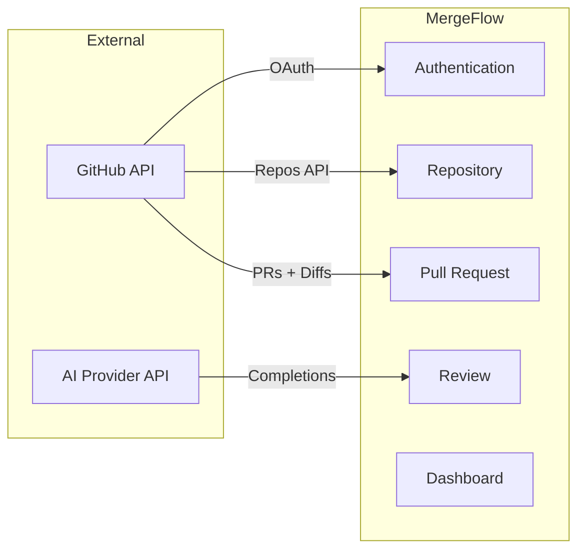

# MergeFlow — Domain Decomposition

> **Status:** Draft | **Created:** 2026-07-05 | **Document ID:** `docs/02-requirements.md`
> **References:** [`00-project-overview.md`](./00-project-overview.md), [`01-product-specification.md`](./01-product-specification.md)

---

## 1. Purpose

Decompose MergeFlow into bounded domains with aggregate roots, ownership rules,
communication contracts, and architectural guardrails. This document defines the
modular structure all subsequent documents follow.

## 2. Scope

**Covered:** Domain identification, aggregate modeling, commands/queries, events,
ownership, communication rules, invariants, dependency graph, context map.

**Excluded:** Implementation, database schema, API contracts, folder structure.

## 3. Design Goals

- High cohesion within each domain
- Low coupling between domains
- No cyclic dependencies
- Single ownership per entity
- Every domain independently testable
- Clear public interface per domain

---

## 4. Domain Overview

| Domain | Purpose | Aggregate Root | Entities | Value Objects | Domain Services |
|--------|---------|---------------|----------|---------------|-----------------|
| **Authentication** | Identity, sessions, tokens | User | User | GitHubIdentity, SessionToken, EncryptedAccessToken | OAuthFlowService |
| **Repository** | Repo connections and lifecycle | Repository | Repository | RepositoryIdentifier, ConnectionStatus | — |
| **Pull Request** | PR sync, metadata, lifecycle | PullRequest | PullRequest | PRIdentifier, DiffStats, PRStatus | SyncPolicyEnforcer |
| **Review** | AI analysis, summaries, risk | Review | Review | Summary, RiskLevel, RiskReasoning, ReviewMetadata | AIProviderAdapter |
| **Dashboard** | Read-only aggregation | *(none)* | *(none)* | *(none)* | DashboardAggregator |

---

## 5. Domain Specifications

### 5.1 Authentication Domain

#### Aggregate Model

| Type | Name | Description |
|------|------|-------------|
| **Aggregate Root** | User | Authenticated identity. Created on first OAuth. Updated on re-login. |
| **Value Object** | GitHubIdentity | GitHub user ID, username, avatar URL, email |
| **Value Object** | SessionToken | Opaque session identifier for authenticated requests |
| **Value Object** | EncryptedAccessToken | GitHub OAuth token, encrypted at rest |
| **Domain Service** | OAuthFlowService | Orchestrates redirect → callback → token exchange → user upsert |

#### Commands and Queries

| Type | Capability | Input | Output |
|------|-----------|-------|--------|
| Command | InitiateOAuth | Redirect URL | GitHub authorization URL |
| Command | CompleteOAuth | Authorization code | Authenticated session |
| Command | InvalidateSession | Session token | Confirmation |
| Query | GetCurrentUser | Session token | User identity or unauthorized |
| Query | GetGitHubToken | User ID | Decrypted access token |

#### Domain Events

| Event | When | Consumed By |
|-------|------|-------------|
| `UserAuthenticated` | OAuth completes | Repository (optional prefetch) |
| `SessionExpired` | Session invalidated or timed out | All (clear context) |

#### Domain Invariants

| ID | Invariant |
|----|-----------|
| DI-A1 | Anonymous users cannot access any domain data. |
| DI-A2 | A user is uniquely identified by their GitHub ID. |
| DI-A3 | A session maps to exactly one user. |
| DI-A4 | Access tokens are never stored in plaintext. |

#### Ownership

| Entity | Created By | Updated By | Deleted By | Read By |
|--------|-----------|------------|------------|---------|
| User | Auth (first OAuth) | Auth (re-login) | Never (MVP) | All domains |

#### Dependencies

- **External:** GitHub OAuth API
- **Internal:** None (root domain)

#### Future Evolution

| Scenario | Impact |
|----------|--------|
| Multi-tenancy | User gains an organization reference. Session includes org context. |
| GitLab support | OAuthFlowService becomes provider-aware. User stores provider type. |
| Distributed workers | Session validation must be stateless (JWT) or cached. |

---

### 5.2 Repository Domain

#### Aggregate Model

| Type | Name | Description |
|------|------|-------------|
| **Aggregate Root** | Repository | A GitHub repo connected by a user. Lifecycle: Discovered → Connected → Disconnected. |
| **Value Object** | RepositoryIdentifier | GitHub repo ID + full name (owner/repo) |
| **Value Object** | ConnectionStatus | Enum: Connected, Disconnected |

#### Commands and Queries

| Type | Capability | Input | Output |
|------|-----------|-------|--------|
| Command | ConnectRepositories | User ID, list of repo IDs | Connected repositories |
| Command | DisconnectRepository | User ID, repo ID | Confirmation |
| Query | ListAccessibleRepos | GitHub token | Repo list from GitHub |
| Query | GetConnectedRepos | User ID | Connected repo list |
| Query | GetRepository | User ID, repo ID | Repo detail or not found |

#### Domain Events

| Event | When | Consumed By |
|-------|------|-------------|
| `RepositoryConnected` | User connects a repo | Pull Request |
| `RepositoryDisconnected` | User disconnects a repo | Pull Request, Review |

#### Domain Invariants

| ID | Invariant |
|----|-----------|
| DI-R1 | A repository connection belongs to exactly one user. |
| DI-R2 | Only connected repositories are eligible for sync and analysis. |
| DI-R3 | A disconnected repository cannot receive new reviews. |
| DI-R4 | Duplicate connections for the same user+repo are prevented. |

#### Ownership

| Entity | Created By | Updated By | Deleted By | Read By |
|--------|-----------|------------|------------|---------|
| Repository | Repository (on connect) | Repository (metadata refresh) | TBD (OQ-1) | PR, Review, Dashboard |

#### Dependencies

- **External:** GitHub REST API (repo listing)
- **Internal:** Authentication (user identity, GitHub token)

#### Future Evolution

| Scenario | Impact |
|----------|--------|
| Multi-tenancy | Repository gains org reference. Shared repos across org members. |
| GitLab support | ListAccessibleRepos becomes provider-aware. RepositoryIdentifier includes provider type. |
| Per-repo settings | Repository aggregate gains configuration value objects (custom sync policy, etc.). |

---

### 5.3 Pull Request Domain

#### Aggregate Model

| Type | Name | Description |
|------|------|-------------|
| **Aggregate Root** | PullRequest | A PR synced from GitHub. Lifecycle: Synced → Analyzing → Reviewed → Stale. |
| **Value Object** | PRIdentifier | GitHub PR number + repo reference |
| **Value Object** | DiffStats | Lines added, lines removed, files changed |
| **Value Object** | PRStatus | Enum: Open, Merged, Closed |
| **Domain Service** | SyncPolicyEnforcer | Applies sync policy (open + last N merged) to filter which PRs to fetch |

#### Commands and Queries

| Type | Capability | Input | Output |
|------|-----------|-------|--------|
| Command | SyncPullRequests | User ID, repo IDs (optional) | Sync result (created, updated, failed) |
| Query | GetPRsForRepo | User ID, repo ID, filters | Paginated PR list |
| Query | GetPRDetail | User ID, PR ID | PR metadata + diff stats |
| Query | GetPRDiff | User ID, PR ID | Raw diff content |
| Query | GetAllUserPRs | User ID, filters | PRs across all connected repos |

#### Domain Events

| Event | When | Consumed By |
|-------|------|-------------|
| `PullRequestSynced` | PR created or updated via sync | Dashboard |
| `PullRequestUpdated` | Existing PR metadata changed | Dashboard |

#### Domain Invariants

| ID | Invariant |
|----|-----------|
| DI-P1 | A pull request belongs to exactly one repository. |
| DI-P2 | Sync is idempotent — running it twice produces the same result. |
| DI-P3 | Sync never triggers AI analysis. |
| DI-P4 | Sync policy changes do not affect existing persisted data. |
| DI-P5 | Only connected repositories are synced. |

#### Ownership

| Entity | Created By | Updated By | Deleted By | Read By |
|--------|-----------|------------|------------|---------|
| PullRequest | Pull Request (on sync) | Pull Request (on re-sync) | TBD (OQ-1) | Review, Dashboard |

#### Dependencies

- **External:** GitHub REST API (PR listing, diff retrieval)
- **Internal:** Authentication (GitHub token), Repository (connected repo list)

#### Future Evolution

| Scenario | Impact |
|----------|--------|
| Webhooks | SyncPullRequests becomes event-driven in addition to manual. Command interface unchanged. |
| GitLab support | GitHub API calls abstracted behind a provider interface. PRIdentifier includes provider. |
| Background workers | SyncPullRequests dispatches to a queue instead of executing inline. |

---

### 5.4 Review Domain

#### Aggregate Model

| Type | Name | Description |
|------|------|-------------|
| **Aggregate Root** | Review | Immutable AI-generated analysis of a PR. |
| **Value Object** | Summary | Structured text: what changed, areas affected, intent |
| **Value Object** | RiskLevel | Enum: Low, Medium, High, Critical |
| **Value Object** | RiskReasoning | Brief justification for the assigned risk level |
| **Value Object** | ReviewMetadata | Timestamp, AI provider name, model version |
| **Domain Service** | AIProviderAdapter | Anti-corruption layer translating provider-specific responses into Review model |

#### Commands and Queries

| Type | Capability | Input | Output |
|------|-----------|-------|--------|
| Command | AnalyzePR | User ID, PR ID | Review (summary + risk) or error |
| Query | GetLatestReview | PR ID | Most recent Review or null |
| Query | GetReviewHistory | PR ID | Ordered list of all Reviews |

#### Domain Events

| Event | When | Consumed By |
|-------|------|-------------|
| `ReviewRequested` | User triggers analysis | *(internal — used for tracking)* |
| `ReviewStarted` | AI provider call initiated | Dashboard (show loading) |
| `ReviewCompleted` | AI response validated and persisted | Dashboard |
| `ReviewFailed` | AI call failed or response invalid | Dashboard |

#### Domain Invariants

| ID | Invariant |
|----|-----------|
| DI-V1 | A review cannot exist without a pull request. |
| DI-V2 | Reviews are immutable after creation. |
| DI-V3 | Every review records its AI provider and timestamp. |
| DI-V4 | No review is persisted on failure — no partial reviews. |
| DI-V5 | Analysis is only permitted for PRs in connected repositories. |

#### Ownership

| Entity | Created By | Updated By | Deleted By | Read By |
|--------|-----------|------------|------------|---------|
| Review | Review (on AI completion) | Never (immutable) | Never (append-only) | Dashboard |

#### Dependencies

- **External:** AI Provider API (OpenAI, Anthropic, Gemini, etc.)
- **Internal:** Pull Request (PR metadata + diff), Repository (connection status)

#### Future Evolution

| Scenario | Impact |
|----------|--------|
| Multiple AI providers | AIProviderAdapter gains provider registry + routing. Review stores which provider was used (already in ReviewMetadata). |
| Prompt versioning | ReviewMetadata gains prompt version. Enables A/B comparison. |
| Background workers | AnalyzePR dispatches to queue. ReviewStarted/Completed become async events. |
| Extract AI domain | If a second consumer of AI appears, extract AIProviderAdapter into its own domain. Additive refactor. |

---

### 5.5 Dashboard Domain

#### Aggregate Model

No aggregate root. No owned entities. Pure presentation and aggregation.

| Type | Name | Description |
|------|------|-------------|
| **Domain Service** | DashboardAggregator | Reads from Repository, Pull Request, Review to compose views |

#### Commands and Queries

| Type | Capability | Input | Output |
|------|-----------|-------|--------|
| Query | GetDashboardData | User ID | Aggregated repos, PRs, latest reviews |
| Query | GetFilteredPRs | User ID, filters (risk, repo, status) | Filtered PR list with review data |

#### Domain Events

| Produced | None |
|----------|------|
| **Consumed** | PullRequestSynced, PullRequestUpdated, ReviewCompleted, ReviewFailed |

#### Domain Invariants

| ID | Invariant |
|----|-----------|
| DI-D1 | Dashboard shows only the authenticated user's data. |
| DI-D2 | Dashboard is read-only — it never modifies data in other domains. |

#### Ownership

No entities owned. No write operations.

#### Dependencies

- **Internal:** Repository, Pull Request, Review (read-only queries)
- **External:** None

#### Future Evolution

| Scenario | Impact |
|----------|--------|
| User preferences | Dashboard gains a UserPreferences entity (saved filters, layout). |
| Team dashboards | Requires Organization domain. Dashboard gains org-scoped queries. |
| Trend analytics | Dashboard gains time-series queries against Review history. |

---

## 6. Cross-Domain Communication Rules

### 6.1 Allowed Dependencies

Dependencies must flow **downstream only** — from root (Auth) toward leaf (Dashboard).

### 6.2 Dependency Rules

| Rule | Description |
|------|-------------|
| ✅ Downstream may query upstream | Review may query Pull Request for diff. |
| ✅ Upstream may emit events consumed downstream | Repository emits RepositoryDisconnected, Review consumes it. |
| ❌ Upstream must not depend on downstream | Repository must not import anything from Review. |
| ❌ Siblings must not depend on each other | Review and Dashboard must not depend on each other directly. |
| ❌ No circular dependencies | If A depends on B, B must not depend on A. |

### 6.3 Forbidden Dependencies

| From | To | Why Forbidden |
|------|----|---------------|
| Dashboard | Review, PR, Repo (write) | Dashboard is read-only (DI-D2) |
| Review | Authentication (direct) | Review receives user context from caller, does not import Auth |
| Pull Request | Review | PR must not know about AI analysis (DI-P3) |
| Repository | Pull Request | Repo does not know about PRs |
| Repository | Review | Repo does not know about reviews |
| Authentication | Any downstream | Root domain has zero internal dependencies |

### 6.4 Communication Contracts

| From → To | Mechanism | Contract |
|-----------|-----------|----------|
| Auth → All | Synchronous query | GetCurrentUser returns User identity |
| Auth → PR, Repo | Synchronous query | GetGitHubToken returns decrypted token |
| Repo → PR | Event | RepositoryConnected/Disconnected |
| Repo → Review | Synchronous query | GetRepository returns connection status |
| PR → Review | Synchronous query | GetPRDetail/GetPRDiff returns PR data |
| All → Dashboard | Synchronous query | Each domain exposes read queries |

> **Design Decision:** Synchronous queries for MVP, events for side effects.
>
> **Why:** In a single-process MVP (C7), synchronous function calls are simpler
> and debuggable. Events are used only where one domain's action must notify
> another (e.g., disconnect → block reviews). No event bus infrastructure needed.
>
> **Reversible?** Yes. Replace function calls with async messages when
> distributing. Domain interfaces remain identical — only the transport changes.

---

## 7. Ownership Summary

### 7.1 Entity Ownership Matrix

| Entity | Creating Domain | Updating Domain | Deleting Domain | Reading Domains |
|--------|----------------|-----------------|-----------------|-----------------|
| User | Auth | Auth | Never (MVP) | All |
| Repository | Repository | Repository | TBD (OQ-1) | PR, Review, Dashboard |
| PullRequest | Pull Request | Pull Request | TBD (OQ-1) | Review, Dashboard |
| Review | Review | Never (immutable) | Never (append-only) | Dashboard |

### 7.2 Ownership Rules

| Rule | Rationale |
|------|-----------|
| Every entity has exactly one creating domain | Prevents write conflicts and ensures clear responsibility. |
| Every entity has at most one updating domain | Same domain that creates it. Prevents distributed write coordination. |
| Immutable entities (Review) have no updating domain | Enforces INV-8. |
| Multiple domains may read an entity | Read access is safe. No coordination needed. |
| Cross-domain writes are forbidden | If Domain A needs to modify Domain B's entity, it requests the change through B's command interface. |

---

## 8. Domain Invariants Summary

| Domain | ID | Invariant |
|--------|----|-----------|
| Auth | DI-A1 | Anonymous users cannot access any domain data |
| Auth | DI-A2 | User uniquely identified by GitHub ID |
| Auth | DI-A3 | Session maps to exactly one user |
| Auth | DI-A4 | Access tokens never stored in plaintext |
| Repo | DI-R1 | Repository connection belongs to exactly one user |
| Repo | DI-R2 | Only connected repos eligible for sync/analysis |
| Repo | DI-R3 | Disconnected repo cannot receive new reviews |
| Repo | DI-R4 | No duplicate connections for same user+repo |
| PR | DI-P1 | PR belongs to exactly one repository |
| PR | DI-P2 | Sync is idempotent |
| PR | DI-P3 | Sync never triggers AI analysis |
| PR | DI-P4 | Sync policy changes don't affect existing data |
| PR | DI-P5 | Only connected repos are synced |
| Review | DI-V1 | Review requires a pull request |
| Review | DI-V2 | Reviews are immutable after creation |
| Review | DI-V3 | Every review records provider + timestamp |
| Review | DI-V4 | No partial reviews persisted on failure |
| Review | DI-V5 | Analysis only for PRs in connected repos |
| Dashboard | DI-D1 | Shows only authenticated user's data |
| Dashboard | DI-D2 | Dashboard never modifies data |

---

## 9. Failure Isolation Matrix

| Failing Domain | Auth | Repo | PR | Review | Dashboard |
|---------------|------|------|----|--------|-----------|
| **Auth fails** | ❌ | ❌ | ❌ | ❌ | ❌ |
| **Repo fails** | ✅ | ❌ | ⚠️ | ⚠️ | ⚠️ |
| **PR fails** | ✅ | ✅ | ❌ | ⚠️ | ⚠️ |
| **Review fails** | ✅ | ✅ | ✅ | ❌ | ⚠️ |
| **Dashboard fails** | ✅ | ✅ | ✅ | ✅ | ❌ |

✅ Unaffected | ⚠️ Degraded (stale data) | ❌ Blocked

Auth is the single point of failure. Acceptable for MVP (C7).

---

## 10. Context Map

| Relationship | Pattern | Rationale |
|-------------|---------|-----------|
| Auth ↔ GitHub | Conformist | Conform to GitHub OAuth. Stable protocol. |
| Repo ↔ GitHub | Conformist | Store GitHub data as-is. |
| PR ↔ GitHub | Conformist | Store GitHub PR data as-is. |
| Review ↔ AI | Anti-Corruption Layer | Normalize diverse provider responses into Review model. Enforces P5. |

---

## 11. Open Questions

| ID | Question | Domains | Resolved In |
|----|----------|---------|-------------|
| OQ-1 | Data retention on repo disconnect? | Repository, PR | `04-database-design.md` |
| OQ-6 | Sync vs async communication in MVP? | All | `03-system-architecture.md` |
| OQ-7 | Dashboard aggregation — joins or separate queries? | Dashboard | `03-system-architecture.md` |
| OQ-8 | Extract AI into own domain? | Review | `08-ai-system.md` |

---

## 12. References

| Document | Relevance |
|----------|-----------|
| [`00-project-overview.md`](./00-project-overview.md) | Principles P4, P5, P6, P8 |
| [`01-product-specification.md`](./01-product-specification.md) | FRs, BRs, INVs assigned to domains |

---

*Next: [`docs/03-system-architecture.md`](./03-system-architecture.md)*
