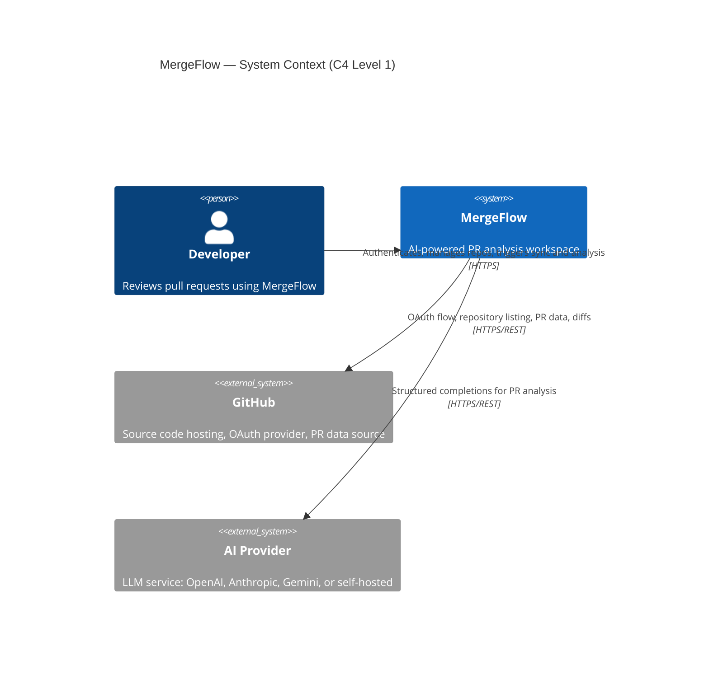
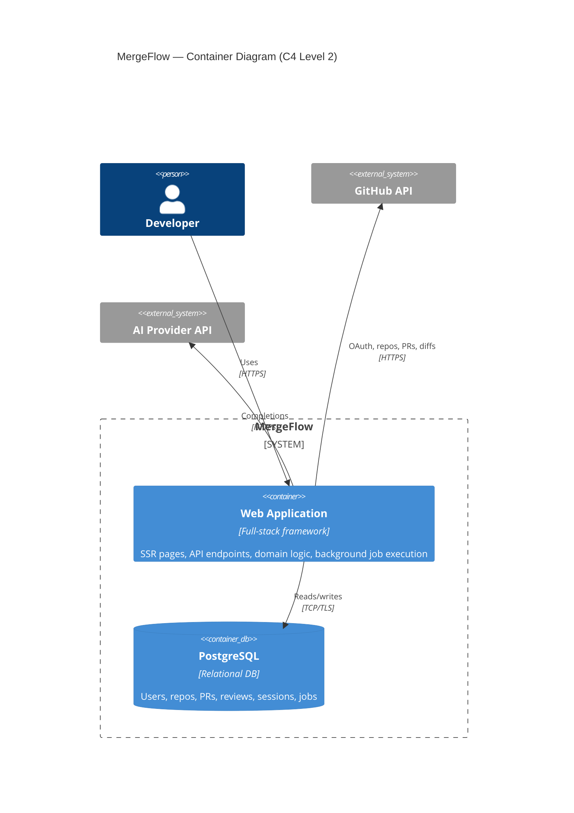
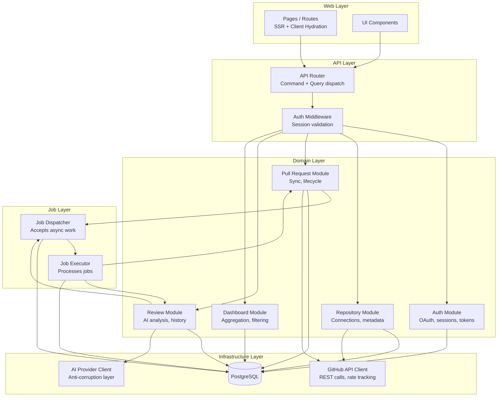
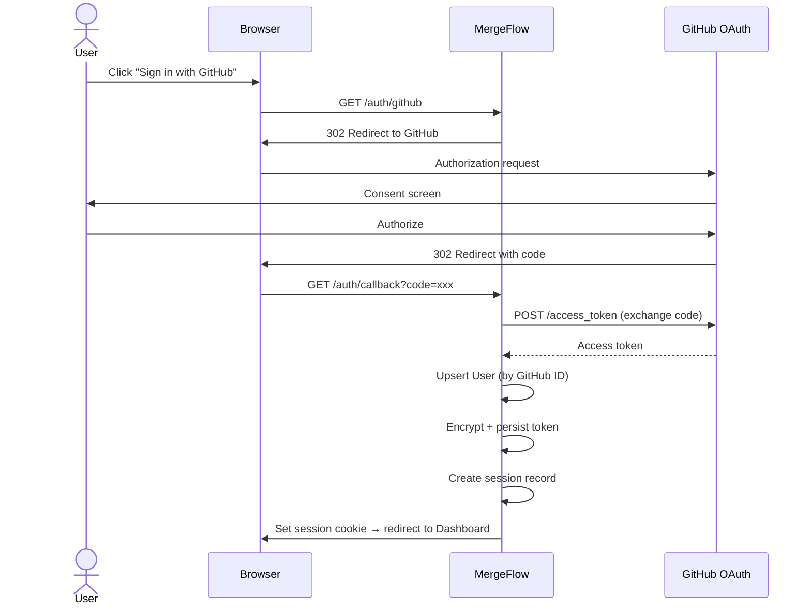
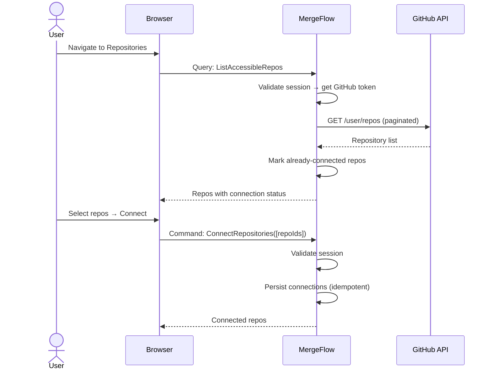
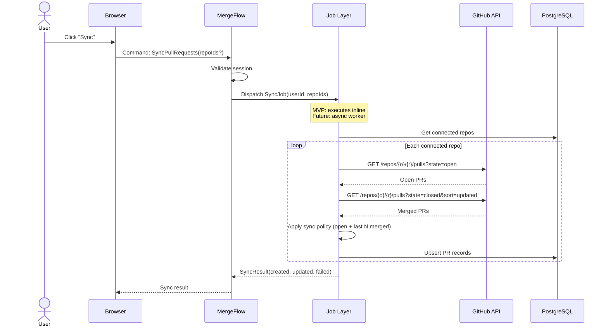
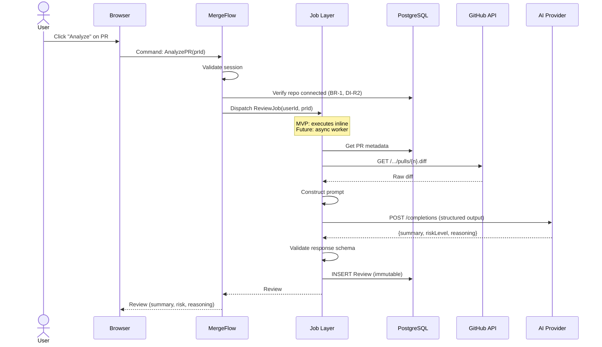
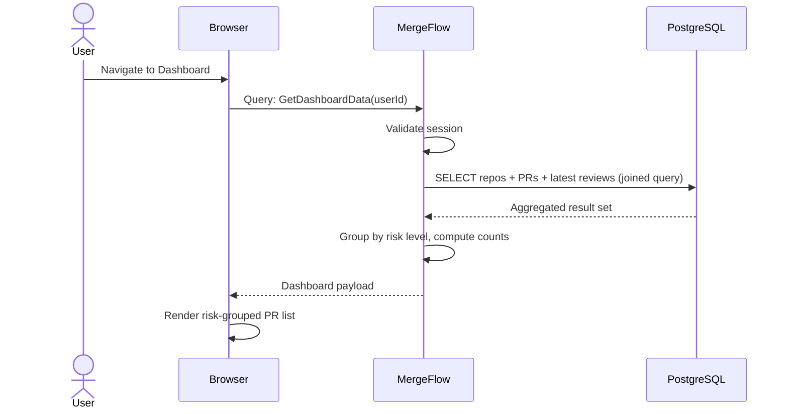
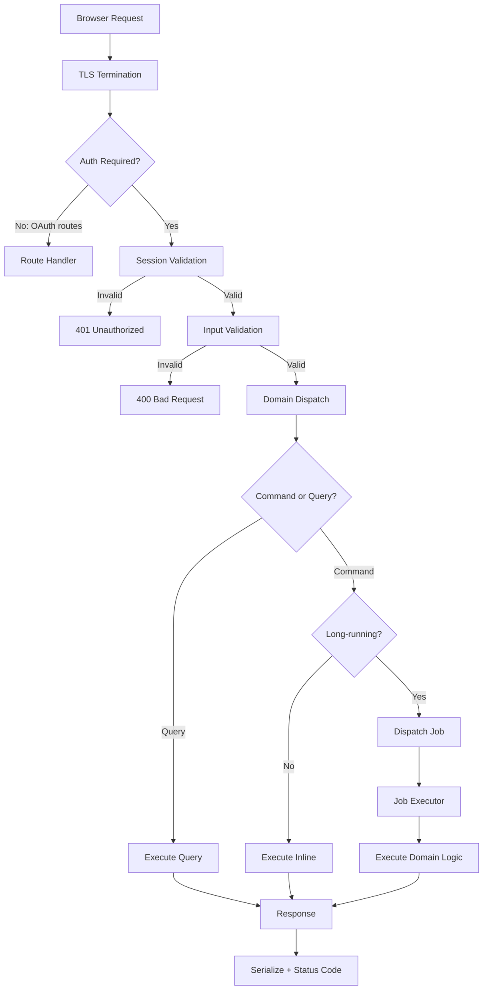
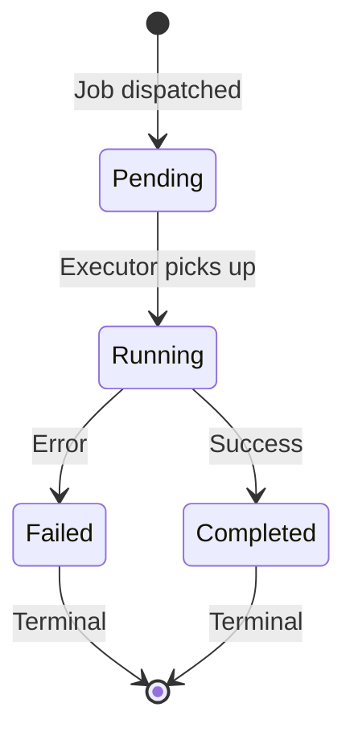

# MergeFlow — System Architecture

> **Status:** Draft | **Created:** 2026-07-05 | **Document ID:** `docs/03-system-architecture.md`
> **References:** [`00-project-overview.md`](./00-project-overview.md), [`01-product-specification.md`](./01-product-specification.md), [`02-domain-analysis.md`](./02-domain-analysis.md)

---

## 1. Purpose

Define how MergeFlow works as a system. This document is the single source of
truth for implementation — every component, flow, boundary, and failure mode is
specified here.

## 2. Scope

**Covered:** System topology, C4 diagrams (Levels 1–3), sequence diagrams,
trust boundaries, failure architecture, deployment, scaling, ADRs.

**Excluded:** Database schema (04), API contracts (06), AI methodology (08).

---

## 3. Architectural Principles

Derived from `00-project-overview.md` and applied to system design.

| Principle | Application |
|-----------|------------|
| P1: Simplicity | Monolithic deployment. No distributed coordination. |
| P2: Modularity | Domain modules with stable interfaces. Implementation varies. |
| P4: Explicit Boundaries | Trust boundaries, failure boundaries, domain boundaries all documented. |
| P5: Provider-Agnostic AI | Anti-corruption layer. AI provider is a pluggable dependency. |
| P6: Extension over Prediction | Interfaces designed for future capability. MVP implements the simplest version. |

**Core Architectural Pattern:**

> Design the interface for the general case. Implement for the MVP case.
> The interface must remain stable as the implementation evolves.

---

## 4. C4 Level 1 — System Context



### External Systems

| System | Role | Protocol | Auth | Rate Limits | Failure Impact |
|--------|------|----------|------|-------------|----------------|
| **GitHub OAuth** | User authentication | HTTPS | Client ID + Secret | N/A | Cannot sign in |
| **GitHub REST API** | Repos, PRs, diffs | HTTPS | User OAuth token | 5,000 req/hr per user | Sync degrades/fails |
| **AI Provider** | PR analysis | HTTPS | API key | Provider-specific | Analysis fails, app continues |

### ADR-004: GitHub OAuth App (MVP)

| | |
|--|--|
| **Context** | Two integration models: OAuth App (user tokens) or GitHub App (installation tokens). |
| **Decision** | OAuth App for MVP. User's own token for API calls. |
| **Alternatives** | GitHub App — better rate limits, fine-grained permissions, webhook support. Requires installation flow and webhook endpoint. |
| **Consequences** | Simpler auth flow. Rate limits per-user (sufficient for MVP: 50 repos). Cannot receive webhooks. |
| **Reversible?** | Yes. Auth module abstracts token source. Downstream domains unaffected. |

---

## 5. C4 Level 2 — Container Diagram



### ADR-001: Monolithic Architecture

| | |
|--|--|
| **Context** | MVP targets individuals and small teams. C7: no distributed services in MVP. |
| **Decision** | Single deployable unit: UI + API + domain logic + job execution. |
| **Alternatives** | (a) Microservices — premature. (b) Backend + SPA — deployment complexity. (c) Serverless — cold starts degrade sync/AI UX. |
| **Consequences** | Single process. Simple deployment and debugging. Vertical scaling initially. |
| **Reversible?** | Yes. Domain boundaries (02) ensure modules extract into services. Interfaces become service contracts. |

### ADR-001b: RPC-Style API

| | |
|--|--|
| **Context** | API serves only its own UI. No external consumers in MVP. |
| **Decision** | RPC-style type-safe procedures (commands + queries) over REST. |
| **Alternatives** | REST — better for public APIs. GraphQL — unnecessary complexity. |
| **Consequences** | End-to-end type safety. Procedures map 1:1 to domain commands/queries. Not suitable for external consumers. |
| **Reversible?** | Yes. Domain layer is transport-agnostic. REST/GraphQL layer is additive. |

---

## 6. C4 Level 3 — Component Diagram



### Layer Rules

| Rule | Enforcement |
|------|------------|
| Web → API only | Pages never call domain or DB directly |
| API → Domain only | API validates + delegates. No business logic. |
| Domain → Infrastructure only | Business logic depends on abstractions |
| Domain → Job Layer for async work | Domains submit jobs; never execute long-running work inline |
| No lateral domain imports | Per 02 §6 communication rules |
| Infrastructure has no upstream deps | Clients/DB are injected |

---

## 7. Trust Boundaries

```
┌─ UNTRUSTED ─────────────────────────────────────────────────────┐
│  Browser                                                        │
│  • Client-side code (can be tampered)                           │
│  • User input (must be validated)                               │
│  • Session cookie (must be verified server-side)                │
└────────────────────────┬────────────────────────────────────────┘
                         │ HTTPS / TLS
┌─ TRUST BOUNDARY 1 ────▼────────────────────────────────────────┐
│  MergeFlow Server (Trusted)                                    │
│                                                                 │
│  ┌─ TRUST BOUNDARY 2 ────────────────────────────────────────┐ │
│  │  GitHub API Responses (Semi-Trusted)                       │ │
│  │  • Structurally valid but content is external              │ │
│  │  • Must validate schema, handle unexpected fields          │ │
│  │  • Rate limit headers must be respected                    │ │
│  └────────────────────────────────────────────────────────────┘ │
│                                                                 │
│  ┌─ TRUST BOUNDARY 3 ────────────────────────────────────────┐ │
│  │  AI Provider Responses (Semi-Trusted)                      │ │
│  │  • Structurally unpredictable (LLM output)                 │ │
│  │  • Must validate against expected schema                   │ │
│  │  • Must sanitize before persistence                        │ │
│  │  • Must reject and fail gracefully on invalid output       │ │
│  └────────────────────────────────────────────────────────────┘ │
│                                                                 │
│  ┌─ TRUSTED ─────────────────────────────────────────────────┐ │
│  │  PostgreSQL (Fully Trusted)                                │ │
│  │  • Internal, encrypted connection                          │ │
│  │  • Parameterized queries via ORM                           │ │
│  └────────────────────────────────────────────────────────────┘ │
└─────────────────────────────────────────────────────────────────┘
```

### Validation Requirements per Boundary

| Boundary | Validations |
|----------|-------------|
| Browser → Server | Session cookie verification. Input type/length validation. CSRF protection. |
| Server → GitHub | HTTP status handling. Response schema validation. Pagination handling. Rate limit tracking. |
| Server → AI Provider | Response schema validation. Structured output parsing. Timeout enforcement. Content sanitization. |
| Server → PostgreSQL | Parameterized queries (ORM). Connection encryption. Pool management. |

---

## 8. Sequence Diagrams

### 8.1 Authentication



### ADR-003: Server-Side Sessions

| | |
|--|--|
| **Context** | Need authenticated state across requests. |
| **Decision** | Server-side sessions with encrypted HTTP-only cookies. |
| **Alternatives** | JWT — stateless but irrevocable. |
| **Consequences** | Sessions stored in DB. Immediate logout. Slight lookup overhead per request. |
| **Reversible?** | Yes. Session interface internal to Auth module. |

### 8.2 Repository Connection



### 8.3 Pull Request Synchronization



### ADR-006: Synchronization Strategy

| | |
|--|--|
| **Context** | MergeFlow needs PR data from GitHub. Multiple strategies exist: manual trigger, scheduled polling, webhooks, event-driven. |
| **Decision** | The synchronization architecture supports any trigger mechanism. The sync interface is: `SyncPullRequests(userId, repoIds?) → SyncResult`. The trigger is decoupled from the execution. |
| **MVP Implementation** | Manual trigger only. User clicks "Sync." |
| **Future Implementations** | (a) Scheduled polling via cron job. (b) GitHub webhooks via GitHub App. (c) Event-driven via GitHub App webhook events. None require changes to the sync interface or domain logic. |
| **Consequences** | Sync logic is trigger-agnostic. Adding new triggers is additive — register a new event source that calls the same interface. |
| **Reversible?** | N/A — the architecture is already general. Only the trigger changes. |

### 8.4 AI Review



### ADR-005: Asynchronous Review Jobs

| | |
|--|--|
| **Context** | AI analysis takes 5–30 seconds. This is too long for a simple synchronous request in production but the MVP needs simplicity. |
| **Decision** | The architectural contract is asynchronous. `AnalyzePR` dispatches a ReviewJob. The caller receives a job reference. The result is delivered when complete. |
| **MVP Implementation** | The job dispatcher executes inline and returns the result synchronously. The caller doesn't know the difference — the interface is the same. |
| **Future Implementation** | (a) Job written to DB, worker picks it up, client polls for result. (b) Server-Sent Events push result to client. Neither changes the domain logic or job interface. |
| **Consequences** | UI must handle loading/pending state from day one. Job table in DB from day one (even if jobs complete instantly in MVP). Clean upgrade path. |
| **Reversible?** | N/A — async is the architecture. Inline execution is the MVP optimization. |

### 8.5 Dashboard



---

## 9. Request Lifecycle

Every request follows this pipeline:



### Error Responses

| Stage | Failure | HTTP Status | Behavior |
|-------|---------|------------|----------|
| Session validation | Invalid/expired | 401 | Redirect to login |
| Input validation | Malformed input | 400 | Error detail returned |
| Domain dispatch | Business rule violation | 409 | Error with rule context |
| Domain dispatch | Entity not found | 404 | Error with entity type |
| Domain dispatch | Unauthorized access | 403 | No detail (prevent enumeration) |
| External call | GitHub error | 502 | Upstream error, retry guidance |
| External call | AI provider error | 502 | Upstream error, retry guidance |
| External call | Timeout | 504 | Gateway timeout |
| Database | Connection/query error | 500 | Generic server error |

---

## 10. Background Processing Architecture

### ADR-007: Background Processing as Architectural Capability

| | |
|--|--|
| **Context** | Sync and AI analysis are inherently long-running. The architecture must support async execution regardless of MVP implementation. |
| **Decision** | Background processing is a first-class architectural capability. Every long-running operation is modeled as a Job with a defined lifecycle. |
| **MVP Implementation** | Jobs execute inline within the request. The Job Dispatcher calls the Job Executor synchronously. No queue, no worker process. |
| **Future Implementation** | (a) Job Dispatcher writes to a jobs table. (b) Worker process (same or separate) polls for pending jobs. (c) Job completion triggers notification. No domain logic changes. |
| **Consequences** | Jobs table exists from day one. Job lifecycle (Pending → Running → Completed/Failed) tracked from day one. Clean async upgrade path. |

### Job Lifecycle



### Job Types

| Job Type | Domain | Input | Output | Idempotent? |
|----------|--------|-------|--------|-------------|
| `SyncJob` | Pull Request | userId, repoIds | SyncResult | ✅ Yes (upsert) |
| `ReviewJob` | Review | userId, prId | Review | ⚠️ Append-only (new review each time) |

### MVP vs Future Execution

| Aspect | MVP (Inline) | Future (Async) |
|--------|-------------|----------------|
| Job dispatch | Synchronous function call | Write to jobs table |
| Job execution | Same request, same process | Worker process polls jobs table |
| Result delivery | Returned in HTTP response | Client polls or SSE push |
| Concurrency | One job at a time per request | Multiple workers, configurable concurrency |
| Failure handling | Error returned to caller | Job marked Failed, retry policy applied |

---

## 11. Failure Architecture

### 11.1 Failure Domains

Each bounded context is a failure domain. Failures are **contained** within
domain boundaries per the isolation matrix from `02-domain-analysis.md` §9.

| Principle | Rule |
|-----------|------|
| **Blast radius** | A domain failure must not corrupt another domain's data |
| **Graceful degradation** | Downstream domains show stale data rather than crash |
| **No partial writes** | Commands either fully succeed or fully fail. No half-synced state. |
| **Explicit failure** | Every failure is surfaced to the caller with actionable context |

### 11.2 External Service Failure Matrix

| Service | Failure | Detection | Strategy | User Impact |
|---------|---------|-----------|----------|-------------|
| GitHub OAuth | Down/5xx | HTTP error on callback | Show error. No retry. | Cannot sign in. |
| GitHub API | 403 Rate Limited | `X-RateLimit-Remaining` header | Abort sync. Show reset time. | Partial sync. Wait. |
| GitHub API | 5xx / Timeout | HTTP error / timeout | Retry once with backoff. Abort on second failure. | Sync fails. Data preserved. |
| GitHub API | 404 | HTTP 404 | Repo/PR deleted. Mark inaccessible. | Item removed from view. |
| AI Provider | 429 Rate Limited | HTTP 429 | Fail job immediately. User retries. | Analysis fails. |
| AI Provider | 5xx / Timeout | HTTP error / timeout | Retry once. Fail job on second error. | Analysis fails. No review saved (DI-V4). |
| AI Provider | Malformed response | Schema validation | Reject. Fail job. | Analysis fails. |
| PostgreSQL | Down | Connection error | Application crashes. Restart. | Full outage. |

### 11.3 Idempotency

| Operation | Idempotent? | Mechanism |
|-----------|------------|-----------|
| SyncPullRequests | ✅ | Upsert by GitHub PR ID |
| ConnectRepository | ✅ | Unique constraint on user+repo |
| DisconnectRepository | ✅ | State transition is idempotent |
| AnalyzePR | ⚠️ Append-only | By design (BR-4). Each call creates new review. |

### 11.4 Data Consistency

| Scenario | Strategy |
|----------|----------|
| Sync interrupted mid-repo | Successfully synced repos preserved. Failed repos reported. |
| AI call fails after diff fetch | No review persisted. Diff is not cached (re-fetched on retry). |
| Session expires during long sync | Job continues (it has the token). Result may not reach browser. |
| Concurrent syncs for same repo | Second sync waits or is rejected. Upsert ensures no corruption. |

---

## 12. Deployment Architecture

### MVP

```
┌──────────────────────────────────────┐
│         Deployment Environment       │
│                                      │
│  ┌─────────────────────────────┐     │
│  │  MergeFlow Application      │     │
│  │  (Single Instance)           │     │
│  │  Port 3000                   │     │
│  └──────────────┬──────────────┘     │
│                 │                    │
│  ┌──────────────▼──────────────┐     │
│  │  PostgreSQL (Managed)        │     │
│  │  Single Instance             │     │
│  └─────────────────────────────┘     │
└──────────────────────────────────────┘
          │                │
     ┌────▼────┐     ┌─────▼─────┐
     │ GitHub  │     │    AI     │
     │  API    │     │ Provider  │
     └─────────┘     └───────────┘
```

### Environment Variables

| Variable | Purpose | Sensitivity |
|----------|---------|-------------|
| `DATABASE_URL` | PostgreSQL connection | 🔴 Secret |
| `GITHUB_CLIENT_ID` | OAuth identifier | 🟡 Config |
| `GITHUB_CLIENT_SECRET` | OAuth secret | 🔴 Secret |
| `AI_PROVIDER_API_KEY` | AI authentication | 🔴 Secret |
| `AI_PROVIDER_TYPE` | Provider selection | 🟢 Config |
| `SESSION_SECRET` | Cookie encryption key | 🔴 Secret |
| `APP_URL` | Public URL (OAuth callback) | 🟢 Config |

All secrets via environment variables. Never in source. Never committed.

---

## 13. Scaling Strategy

| Phase | Trigger | Action |
|-------|---------|--------|
| **0 (MVP)** | Baseline | Single instance, single DB, inline jobs |
| **1** | Dashboard > 2s | Database indexes, query optimization |
| **2** | Sync > 60s | Move jobs to async (DB-backed queue, same process) |
| **3** | Concurrent AI > 5 | Separate worker process for ReviewJobs |
| **4** | Users > 100 | Horizontal app instances + session store |
| **5** | Total PRs > 10k | Read replicas, connection pooling |

Each phase requires only configuration or additive changes. No domain logic rewrites.

---

## 14. Architectural Tradeoffs

| Decision | Gain | Cost |
|----------|------|------|
| Monolith | Simplicity, fast iteration | No independent domain deployment |
| Async job interface (inline MVP) | Clean upgrade path | Slight abstraction overhead in MVP |
| Single database | ACID, simple ops | Scaling ceiling for reads |
| RPC over REST | Type safety | Not suitable for external consumers |
| OAuth over GitHub App | Simple auth | Lower rate limits, no webhooks |
| Sessions over JWT | Revocable auth | DB lookup per request |

---

## 15. ADR Index

| ADR | Title | Status |
|-----|-------|--------|
| ADR-001 | Monolithic Architecture | ✅ Approved (§5) |
| ADR-001b | RPC-Style API | ✅ Approved (§5) |
| ADR-003 | Server-Side Sessions | ✅ Approved (§8.1) |
| ADR-004 | GitHub OAuth App (MVP) | ✅ Approved (§4) |
| ADR-005 | Asynchronous Review Jobs | ✅ Approved (§8.4) |
| ADR-006 | Synchronization Strategy | ✅ Approved (§8.3) |
| ADR-007 | Background Processing Capability | ✅ Approved (§10) |

---

## 16. Risks

| Risk | Probability | Impact | Mitigation |
|------|------------|--------|------------|
| AI latency > 30s regularly | Medium | UX degrades | Async jobs + loading UI. Move to worker when pattern emerges. |
| GitHub rate limit during sync | Low (MVP) | Sync fails | Track `X-RateLimit-Remaining`. Abort early if low. |
| Large diffs exceed context window | Medium | Analysis fails | Strategy in `08-ai-system.md`. |
| Session secret compromise | Low | Full auth bypass | Secret rotation. Mass session invalidation. |

---

## 17. Open Questions

### Resolved

| ID | Question | Resolution |
|----|----------|------------|
| OQ-5 | Sync policy N configurable in UI? | No. Config-only for MVP. |
| OQ-6 | Sync vs async communication? | Async interface, inline MVP execution. |
| OQ-7 | Dashboard aggregation? | Joined DB query. |

### Remaining

| ID | Question | Resolved In |
|----|----------|-------------|
| OQ-1 | Data retention on disconnect? | `04-database-design.md` |
| OQ-2 | Oversized diffs? | `08-ai-system.md` |
| OQ-9 | Connection pooling? | `04-database-design.md` |
| OQ-10 | Session storage details? | `10-security.md` |

---

## 18. References

| Document | Relevance |
|----------|-----------|
| [`00-project-overview.md`](./00-project-overview.md) | Constraints C3, C7, C8 |
| [`01-product-specification.md`](./01-product-specification.md) | NFRs, performance targets |
| [`02-domain-analysis.md`](./02-domain-analysis.md) | Domain boundaries, commands, queries, events |

---

*This document answers "how does MergeFlow work?" Implementation operates
within this architecture.*

*Next: [`docs/04-database-design.md`](./04-database-design.md)*
