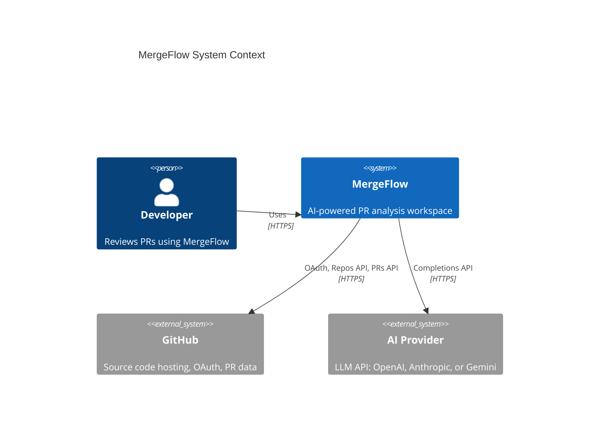
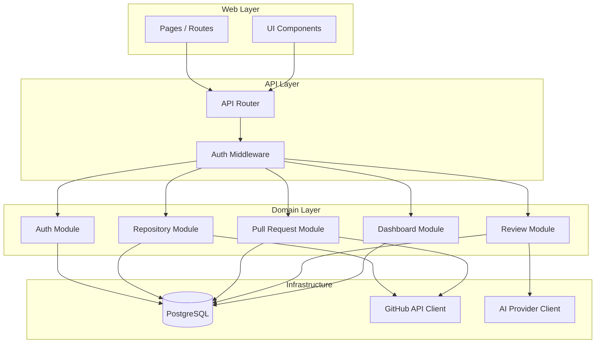
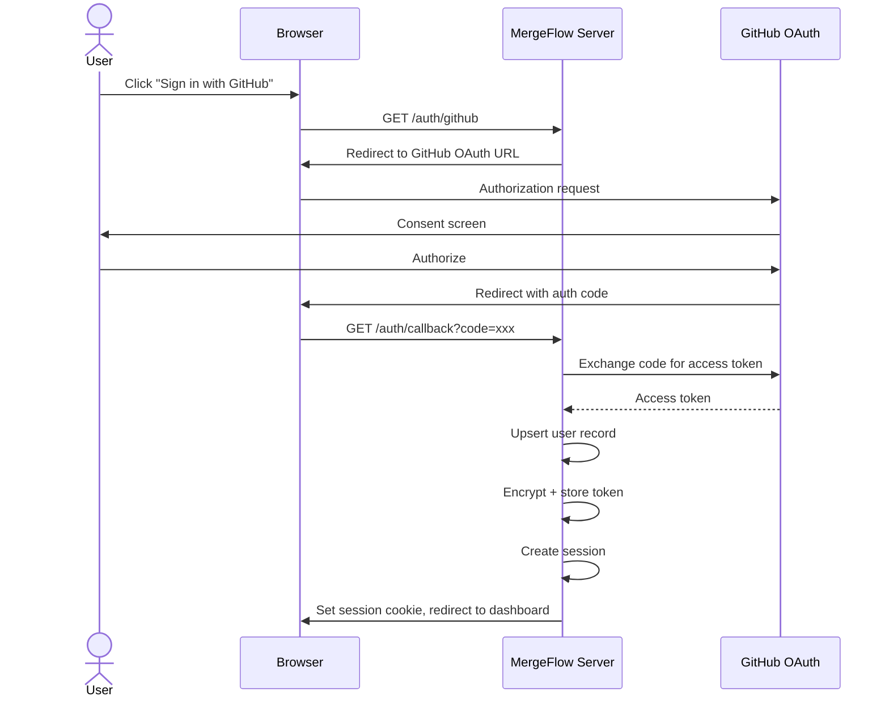
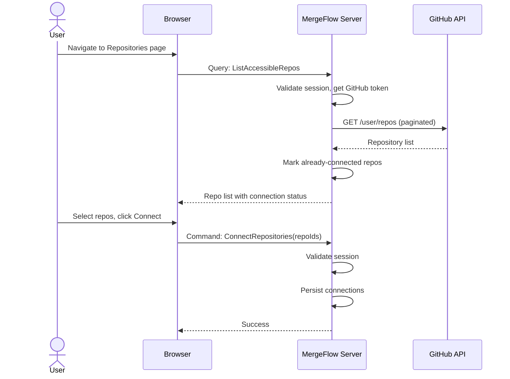
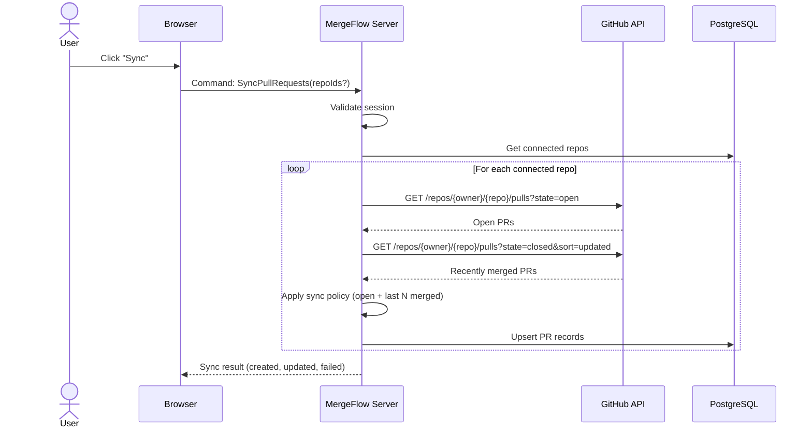
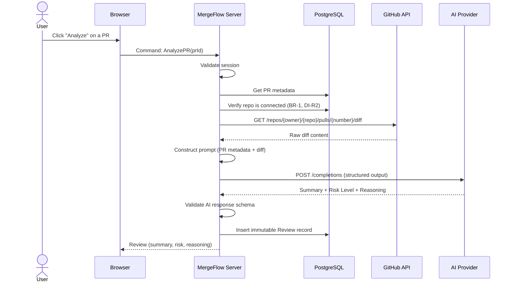
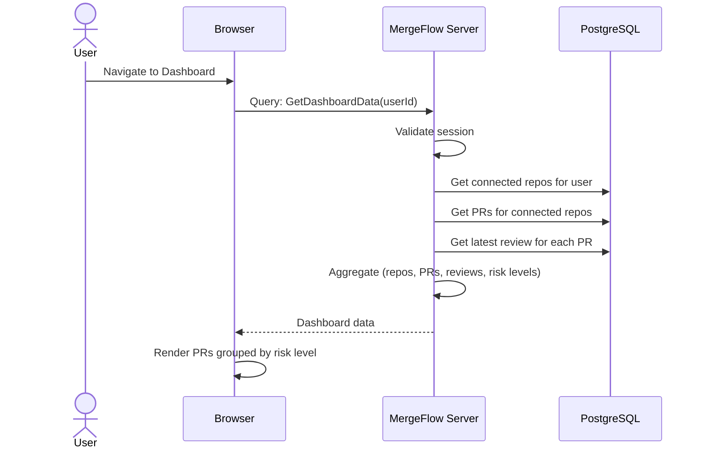

# MergeFlow — System Architecture

> **Status:** Draft | **Created:** 2026-07-05 | **Document ID:** `docs/03-system-architecture.md`
> **References:** [`00-project-overview.md`](./00-project-overview.md), [`01-product-specification.md`](./01-product-specification.md), [`02-domain-analysis.md`](./02-domain-analysis.md)

---

## 1. Purpose

Define how MergeFlow works as a system: components, boundaries, flows, failure
modes, deployment, and scaling strategy. This is the single source of truth
for implementation.

## 2. Scope

**Covered:** System topology, component architecture, sequence diagrams for all
critical flows, trust boundaries, failure handling, deployment, ADRs.

**Excluded:** Database schema (04), API contracts (06), AI methodology (08).

---

## 3. High-Level Architecture

MergeFlow is a **monolithic full-stack web application** backed by a single
PostgreSQL database and two external services (GitHub API, AI Provider API).

```
┌─────────────────────────────────────────────────────────┐
│                      Client (Browser)                   │
└──────────────────────────┬──────────────────────────────┘
                           │ HTTPS
┌──────────────────────────▼──────────────────────────────┐
│                   MergeFlow Application                  │
│                                                          │
│  ┌─────────────┐  ┌─────────────┐  ┌────────────────┐  │
│  │   Web Layer  │  │  API Layer  │  │ Domain Layer   │  │
│  │  (SSR + UI)  │  │ (Endpoints) │  │ (Business Logic│  │
│  └──────┬──────┘  └──────┬──────┘  │  per domain)   │  │
│         │                │          └───────┬────────┘  │
│         └────────┬───────┘                  │           │
│                  │                          │           │
│         ┌────────▼──────────────────────────▼────────┐  │
│         │            Data Access Layer                │  │
│         └────────────────────┬───────────────────────┘  │
└──────────────────────────────┼──────────────────────────┘
                               │
          ┌────────────────────┼────────────────────┐
          │                    │                    │
  ┌───────▼──────┐   ┌────────▼───────┐  ┌────────▼────────┐
  │  PostgreSQL   │   │   GitHub API   │  │  AI Provider    │
  │  (Primary DB) │   │   (External)   │  │  (External)     │
  └──────────────┘   └────────────────┘  └─────────────────┘
```

### ADR-001: Monolithic Architecture

| | |
|--|--|
| **Context** | MVP targets individual developers and small teams. Constraint C7 mandates no distributed services. |
| **Decision** | Single deployable unit containing UI, API, and business logic. |
| **Alternatives** | (a) Microservices — premature for MVP scale. (b) Backend + SPA — adds deployment complexity. (c) Serverless functions — cold starts degrade UX for sync/AI calls. |
| **Consequences** | Simpler deployment, debugging, and testing. All domains share one process. Scaling is vertical initially. |
| **Reversible?** | Yes. Domain boundaries from 02 ensure modules can be extracted into services later. The domain interfaces become service contracts. |

---

## 4. Container Diagram



### Internal Containers

| Container | Responsibility | Technology Decision |
|-----------|---------------|---------------------|
| **Web Layer** | Server-side rendering, static assets, client hydration | Full-stack framework with SSR |
| **API Layer** | Type-safe endpoints, request validation, auth middleware | RPC-style API (not REST — see ADR below) |
| **Domain Layer** | Business logic organized by bounded context | Pure functions + domain services per 02 |
| **Data Access Layer** | ORM queries, migrations, connection pooling | Type-safe ORM with PostgreSQL |
| **PostgreSQL** | Primary persistence for all entities | Single database, schema per 04 |

### ADR-001b: RPC-Style API over REST

| | |
|--|--|
| **Context** | MergeFlow is a single full-stack app. The API serves only its own UI. |
| **Decision** | RPC-style type-safe API (procedures: commands + queries) rather than REST. |
| **Alternatives** | REST — better for public APIs, but MergeFlow's API is internal. GraphQL — unnecessary complexity for this data model. |
| **Consequences** | End-to-end type safety. No URL design overhead. Procedures map 1:1 to domain commands/queries from 02. Not suitable if external API consumers are needed later. |
| **Reversible?** | Yes. Domain layer is transport-agnostic. Adding a REST or GraphQL layer on top is additive. |

---

## 5. Component Architecture



### Layer Rules

| Rule | Rationale |
|------|-----------|
| Web Layer → API Layer only | UI never calls domain or database directly |
| API Layer → Domain Layer only | API handles auth/validation, delegates to domains |
| Domain Layer → Infrastructure only | Business logic depends on abstractions, not HTTP clients |
| No lateral dependencies between domain modules | Enforced by 02 §6 communication rules |
| Infrastructure has no upstream dependencies | Clients/DB are injected, not imported by layers above |

---

## 6. Trust Boundaries

```
┌─ UNTRUSTED ──────────────────────────────────────────────────┐
│  Browser (client-side code, user input)                      │
└──────────────────────────┬───────────────────────────────────┘
                           │ HTTPS (TLS)
┌─ TRUSTED ────────────────▼───────────────────────────────────┐
│  MergeFlow Server                                            │
│  ┌─ SEMI-TRUSTED ─────────────────────────────────────────┐  │
│  │  GitHub API Responses (external, could be malformed)    │  │
│  │  AI Provider Responses (external, could be malformed)   │  │
│  └─────────────────────────────────────────────────────────┘  │
│  ┌─ TRUSTED ──────────────────────────────────────────────┐  │
│  │  PostgreSQL (internal, encrypted connection)            │  │
│  └─────────────────────────────────────────────────────────┘  │
└──────────────────────────────────────────────────────────────┘
```

| Boundary | Validation Required |
|----------|-------------------|
| Browser → Server | Session validation, input sanitization, CSRF protection |
| Server → GitHub API | Response schema validation, error handling, rate limit handling |
| Server → AI Provider | Response schema validation, structured output parsing, timeout handling |
| Server → PostgreSQL | Parameterized queries (ORM handles), connection encryption |

---

## 7. External Systems

| System | Protocol | Auth Method | Rate Limits | Failure Mode |
|--------|----------|-------------|-------------|--------------|
| **GitHub OAuth** | HTTPS | Client ID + Secret | N/A | User cannot sign in |
| **GitHub REST API** | HTTPS | User's OAuth token | 5,000 req/hr per user | Sync degrades or fails |
| **AI Provider** | HTTPS | API key | Varies by provider/tier | Analysis fails, app continues |

### ADR-004: GitHub OAuth over GitHub App (MVP)

| | |
|--|--|
| **Context** | Two options for GitHub integration: OAuth App (user tokens) or GitHub App (installation tokens). |
| **Decision** | OAuth App for MVP. User's own token for API calls. |
| **Alternatives** | GitHub App — better rate limits (5,000/hr per installation), fine-grained permissions, webhook support. But requires installation flow, webhook endpoint, and more complex token management. |
| **Consequences** | Simpler auth flow. Rate limits are per-user (sufficient for MVP capacity of 50 repos). Cannot receive webhooks. |
| **Reversible?** | Yes. Migration to GitHub App is additive. Auth module handles the token source — downstream domains don't care where the token came from. |

---

## 8. Sequence Diagrams

### 8.1 Authentication Flow



### ADR-003: Session-Based Auth over JWT

| | |
|--|--|
| **Context** | Need to maintain authenticated state across requests. |
| **Decision** | Server-side sessions with encrypted cookies. |
| **Alternatives** | JWT — stateless, but can't revoke. Token stored in cookie is simpler and revocable. |
| **Consequences** | Sessions stored in database. Logout invalidates immediately. Slight overhead per request for session lookup. |
| **Reversible?** | Yes. Session interface is internal to Auth module. |

### 8.2 Repository Connection Flow



### 8.3 Pull Request Synchronization Flow



### 8.4 AI Review Flow



### ADR-005: Synchronous AI Calls (MVP)

| | |
|--|--|
| **Context** | AI review takes 5–30 seconds. Options: synchronous HTTP, polling, or server-sent events. |
| **Decision** | Synchronous request in MVP. Browser shows loading state. Server holds connection until AI responds. |
| **Alternatives** | (a) Polling — client submits, then polls for result. More complex. (b) SSE/WebSocket — real-time push. Infrastructure overhead. |
| **Consequences** | Simple implementation. 30s is within HTTP timeout defaults (60s). Browser must show clear loading state. If AI provider is slow, UX degrades. |
| **Reversible?** | Yes. The AnalyzePR command interface stays identical. Only the transport changes (return job ID → poll for result). Domain layer untouched. |

### 8.5 Dashboard Flow



---

## 9. Request Lifecycle

Every request follows this pipeline:

```
Browser Request
    │
    ▼
┌──────────────────┐
│ 1. TLS Termination│
└────────┬─────────┘
         ▼
┌──────────────────┐
│ 2. Session Check  │  → 401 if no valid session (except OAuth routes)
└────────┬─────────┘
         ▼
┌──────────────────┐
│ 3. Input Validate │  → 400 if malformed
└────────┬─────────┘
         ▼
┌──────────────────┐
│ 4. Domain Dispatch│  → Route to owning domain's command/query
└────────┬─────────┘
         ▼
┌──────────────────┐
│ 5. Business Logic │  → Domain enforces invariants + business rules
└────────┬─────────┘
         ▼
┌──────────────────┐
│ 6. Data Access    │  → DB queries, external API calls
└────────┬─────────┘
         ▼
┌──────────────────┐
│ 7. Response       │  → Serialize result, set status code
└──────────────────┘
```

| Step | Failure | Response |
|------|---------|----------|
| 2 | Invalid/expired session | 401 Unauthorized |
| 3 | Bad input | 400 Bad Request |
| 5 | Business rule violation (e.g., repo not connected) | 403/409 with error detail |
| 6 | GitHub API error | 502 Bad Gateway with retry guidance |
| 6 | AI provider error | 503 Service Unavailable |
| 6 | Database error | 500 Internal Server Error |

---

## 10. Background Processing Strategy

### ADR-007: No Background Workers in MVP

| | |
|--|--|
| **Context** | Sync and AI analysis could benefit from async processing. But C7 says no distributed services, C8 says no assumptions until architecture review. |
| **Decision** | All processing is inline (synchronous) in the MVP. No queues, no workers, no cron jobs. |
| **Alternatives** | (a) In-process queue — adds complexity without horizontal scaling. (b) External queue (Redis/BullMQ) — violates C3 (PostgreSQL only). |
| **Consequences** | Sync blocks the user's request. AI analysis blocks the user's request. Acceptable for MVP scale (one user, few repos). |
| **Reversible?** | Yes. Domain commands are already defined. Wrapping SyncPullRequests or AnalyzePR in a job dispatcher requires no domain changes. |

### When to Revisit

Background processing becomes necessary when:
- Sync takes > 60 seconds (many repos)
- Multiple users trigger concurrent syncs
- AI analysis needs to be batched
- Webhook events need async processing (Phase 2)

The extraction path:
1. Add a jobs table to PostgreSQL (no new infrastructure)
2. SyncPullRequests/AnalyzePR write a job record instead of executing inline
3. A polling worker (same process or separate) picks up jobs
4. Event-based notification when job completes

---

## 11. Failure Handling Strategy

### 11.1 External Service Failures

| Service | Failure | Strategy | User Impact |
|---------|---------|----------|-------------|
| **GitHub OAuth** | Down | Show error on login page. No retry. | Cannot sign in. |
| **GitHub REST API** | 403 Rate Limited | Stop sync for that user. Show remaining reset time. | Partial sync. Retry later. |
| **GitHub REST API** | 5xx / Timeout | Retry once with backoff. On second failure, abort. | Sync fails. Existing data preserved. |
| **GitHub REST API** | 404 on repo/PR | Repo may have been deleted. Mark as inaccessible. | PR/repo removed from view. |
| **AI Provider** | 429 Rate Limited | Return error immediately. User retries manually. | Analysis fails. No review saved. |
| **AI Provider** | 5xx / Timeout | Retry once. On failure, return error. | Analysis fails. No review saved (DI-V4). |
| **AI Provider** | Malformed response | Reject. Return validation error. | Analysis fails. |
| **PostgreSQL** | Connection error | Application crashes. Process restart. | Full outage. |

### 11.2 Idempotency

| Operation | Idempotent? | How |
|-----------|------------|-----|
| SyncPullRequests | ✅ | Upsert by GitHub PR ID. Running twice = same result. |
| ConnectRepository | ✅ | Duplicate connection prevented by unique constraint. |
| AnalyzePR | ⚠️ Append-only | Each call creates a new review. Not idempotent by design (BR-4). User must intentionally re-analyze. |

### 11.3 Circuit Breaker Pattern (Future)

Not implemented in MVP. When GitHub or AI provider has sustained failures,
a circuit breaker would prevent repeated calls and fail fast. Implementation
belongs in `09-background-processing.md` when async processing is introduced.

---

## 12. Deployment Architecture

### MVP Deployment

```
┌─────────────────────────────────┐
│         Cloud Provider          │
│                                 │
│  ┌──────────────────────────┐   │
│  │   MergeFlow Application  │   │
│  │   (Single Instance)      │   │
│  │   Port 3000              │   │
│  └────────────┬─────────────┘   │
│               │                 │
│  ┌────────────▼─────────────┐   │
│  │   PostgreSQL             │   │
│  │   (Managed Instance)     │   │
│  └──────────────────────────┘   │
│                                 │
└─────────────────────────────────┘
         │              │
    ┌────▼────┐   ┌─────▼─────┐
    │ GitHub  │   │    AI     │
    │  API    │   │ Provider  │
    └─────────┘   └───────────┘
```

### Environment Configuration

| Variable | Purpose | Sensitivity |
|----------|---------|-------------|
| `DATABASE_URL` | PostgreSQL connection string | 🔴 Secret |
| `GITHUB_CLIENT_ID` | OAuth app identifier | 🟡 Semi-sensitive |
| `GITHUB_CLIENT_SECRET` | OAuth app secret | 🔴 Secret |
| `AI_PROVIDER_API_KEY` | AI service authentication | 🔴 Secret |
| `AI_PROVIDER_TYPE` | Which AI provider to use | 🟢 Public |
| `SESSION_SECRET` | Session encryption key | 🔴 Secret |
| `APP_URL` | Public URL for OAuth callbacks | 🟢 Public |

All secrets via environment variables. Never in code. Never in version control.

---

## 13. Scaling Strategy

MVP is single-instance. This section documents the growth path.

### 13.1 Vertical Scaling (Phase 1)

Increase instance resources (CPU, RAM). Effective until:
- Database connections become the bottleneck
- Single-threaded event loop limits concurrent AI calls

### 13.2 Horizontal Scaling (Phase 2+)

| Component | Scaling Path | Prerequisite |
|-----------|-------------|--------------|
| **Application** | Multiple instances behind load balancer | Stateless sessions (JWT or shared session store) |
| **Database** | Read replicas for dashboard queries | Connection pooling, query routing |
| **Sync** | Background worker pool | Job queue (PostgreSQL-backed initially) |
| **AI Analysis** | Async job processing | Job queue, webhook for completion |

### 13.3 When Each Scaling Step Is Needed

| Trigger | Action |
|---------|--------|
| Dashboard > 2s under load | Add database indexes, optimize queries |
| Sync > 60s consistently | Move to background processing |
| Concurrent AI calls > 5 | Queue AI requests |
| Users > 100 | Session store, horizontal app instances |
| Repos > 1000 total | Read replicas, connection pooling |

---

## 14. Architectural Tradeoffs

| Decision | What We Gain | What We Give Up |
|----------|-------------|-----------------|
| Monolith | Simplicity, fast iteration, easy debugging | Independent deployment per domain |
| Synchronous AI | Simple request model | UX degrades for slow AI responses |
| No background workers | No queue infrastructure | Cannot process long tasks asynchronously |
| Single database | Simple operations, ACID transactions | Scaling ceiling for read-heavy workloads |
| RPC over REST | Type safety, productivity | Not suitable for external API consumers |
| OAuth over GitHub App | Simple auth flow | Lower rate limits, no webhooks |
| Session over JWT | Revocable sessions | Database lookup per request |

---

## 15. ADR Index

| ADR | Title | Decision | Document |
|-----|-------|----------|----------|
| ADR-001 | System Architecture | Monolithic full-stack application | §3 |
| ADR-001b | API Style | RPC-style over REST | §4 |
| ADR-003 | Authentication | Session-based with encrypted cookies | §8.1 |
| ADR-004 | GitHub Integration | OAuth App over GitHub App for MVP | §7 |
| ADR-005 | AI Processing Model | Synchronous calls in MVP | §8.4 |
| ADR-006 | Sync Strategy | User-triggered polling, no webhooks | §8.3 |
| ADR-007 | Background Processing | No workers in MVP, inline processing | §10 |
| ADR-002 | Database Design | 🔲 Pending | `04-database-design.md` |
| ADR-008 | Multi-tenancy Strategy | 🔲 Pending | `04-database-design.md` |

---

## 16. Risks

| Risk | Probability | Impact | Mitigation |
|------|------------|--------|------------|
| AI calls exceed 30s regularly | Medium | UX degradation | Monitor latency. Move to async if P95 > 20s. |
| GitHub rate limit hit during sync | Low (MVP scale) | Sync fails | Track remaining quota. Abort early if low. |
| Large diffs exceed AI context window | Medium | Analysis fails | Truncation strategy in `08-ai-system.md`. |
| Session secret compromised | Low | Full auth bypass | Rotate secret. Invalidate all sessions. |
| Single database as bottleneck | Low (MVP scale) | Slow queries | Index strategy in `04-database-design.md`. |

---

## 17. Open Questions Resolved

| ID | Question | Resolution |
|----|----------|------------|
| OQ-5 | Is sync policy N configurable in UI? | No. Environment/config only for MVP. UI settings add complexity. |
| OQ-6 | Sync vs async communication? | Synchronous for MVP. Events for side effects only. |
| OQ-7 | Dashboard aggregation strategy? | Database joins. Single query with joined data. No separate calls. |

## 18. Open Questions Remaining

| ID | Question | Resolved In |
|----|----------|-------------|
| OQ-1 | Data retention on disconnect? | `04-database-design.md` |
| OQ-2 | Handling oversized diffs? | `08-ai-system.md` |
| OQ-9 | Connection pooling strategy? | `04-database-design.md` |
| OQ-10 | Session storage strategy? | `10-security.md` |

---

## 19. References

| Document | Relevance |
|----------|-----------|
| [`00-project-overview.md`](./00-project-overview.md) | Constraints C3, C7, C8 govern architecture |
| [`01-product-specification.md`](./01-product-specification.md) | NFRs define performance targets |
| [`02-domain-analysis.md`](./02-domain-analysis.md) | Domain boundaries, commands, queries, events |

---

*This document answers "how does MergeFlow work?" Every subsequent document
operates within this architecture.*

*Next: [`docs/04-database-design.md`](./04-database-design.md)*
