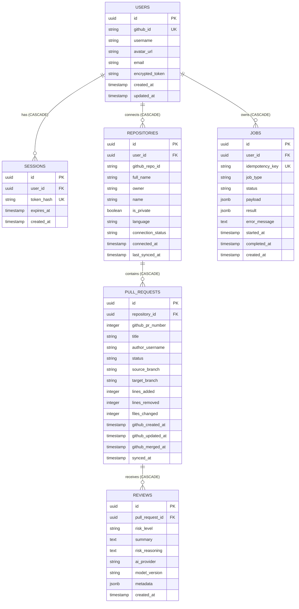

# MergeFlow — Database Design

> **Status:** Draft | **Created:** 2026-07-05 | **Document ID:** `docs/04-database-design.md`
> **References:** [`01-product-specification.md`](./01-product-specification.md), [`02-domain-analysis.md`](./02-domain-analysis.md), [`03-system-architecture.md`](./03-system-architecture.md)

---

## 1. Purpose

Define the physical data model, schema relationships, indexing strategy, and
persistence rules for the MergeFlow application. This document translates the
domain entities from `02-domain-analysis.md` into relational database tables.

## 2. Scope

**Covered:** Entity-Relationship Diagram (ERD), table definitions, foreign key
delete policies, indexing strategy, check constraints, multi-tenancy design,
data retention policies.

**Excluded:** ORM-specific configuration, exact data types for a specific SQL
dialect (though PostgreSQL is assumed).

---

## 3. Entity-Relationship Diagram (ERD)

---

## 4. Table Definitions

### 4.1 `users`

Primary identity table, owned by the Authentication domain.

| Column | Type | Constraints | Description |
|--------|------|-------------|-------------|
| `id` | UUID | PK | Internal unique identifier |
| `github_id` | String | UNIQUE, NOT NULL | GitHub's immutable user ID |
| `username` | String | NOT NULL | GitHub handle |
| `avatar_url` | String | | Profile picture URL |
| `email` | String | | Primary email (if available) |
| `encrypted_token` | String | NOT NULL | Encrypted OAuth access token |
| `created_at` | Timestamp | DEFAULT NOW() | Record creation time |
| `updated_at` | Timestamp | DEFAULT NOW() | Last time user logged in |

### 4.2 `sessions`

Session management, owned by the Authentication domain.

| Column | Type | Constraints | Description |
|--------|------|-------------|-------------|
| `id` | UUID | PK | Internal session ID |
| `user_id` | UUID | FK (users) ON DELETE CASCADE, NOT NULL | Owning user |
| `token_hash` | String | UNIQUE, NOT NULL | SHA-256 hash of the session cookie |
| `expires_at` | Timestamp | NOT NULL | Expiration time |
| `created_at` | Timestamp | DEFAULT NOW() | Login time |

### 4.3 `repositories`

Connected repositories, owned by the Repository domain.

| Column | Type | Constraints | Description |
|--------|------|-------------|-------------|
| `id` | UUID | PK | Internal repository ID |
| `user_id` | UUID | FK (users) ON DELETE CASCADE, NOT NULL | User who connected it |
| `github_repo_id` | String | NOT NULL | GitHub's internal repository ID |
| `full_name` | String | NOT NULL | e.g., `owner/repo` |
| `owner` | String | NOT NULL | Repository owner |
| `name` | String | NOT NULL | Repository name |
| `is_private` | Boolean | NOT NULL | Visibility flag |
| `language` | String | | Primary programming language |
| `connection_status`| String | NOT NULL, CHECK | Must be `CONNECTED` or `DISCONNECTED` |
| `connected_at` | Timestamp | NOT NULL | Time of first connection |
| `last_synced_at` | Timestamp | | Time of last successful PR sync |

*Unique Constraint:* `(user_id, github_repo_id)` — Prevents duplicate connections (DI-R4).

### 4.4 `pull_requests`

Synchronized PRs, owned by the Pull Request domain.

| Column | Type | Constraints | Description |
|--------|------|-------------|-------------|
| `id` | UUID | PK | Internal PR ID |
| `repository_id`| UUID | FK (repos) ON DELETE CASCADE, NOT NULL| Parent repository |
| `github_pr_number`| Integer | NOT NULL | PR number on GitHub (e.g., 14) |
| `title` | String | NOT NULL | PR title |
| `author_username`| String | NOT NULL | User who opened the PR |
| `status` | String | NOT NULL, CHECK | Must be `OPEN`, `MERGED`, or `CLOSED` |
| `source_branch`| String | NOT NULL | Head branch |
| `target_branch`| String | NOT NULL | Base branch |
| `lines_added` | Integer | NOT NULL | Diff stats (updates on re-sync) |
| `lines_removed`| Integer | NOT NULL | Diff stats (updates on re-sync) |
| `files_changed`| Integer | NOT NULL | Diff stats (updates on re-sync) |
| `github_created_at`| Timestamp | NOT NULL | Creation time on GitHub |
| `github_updated_at`| Timestamp | NOT NULL | Last update time on GitHub |
| `github_merged_at` | Timestamp | | Merge time on GitHub |
| `synced_at` | Timestamp | NOT NULL | Last time we fetched this PR |

*Unique Constraint:* `(repository_id, github_pr_number)` — Ensures idempotency for sync.

### 4.5 `reviews`

AI-generated analysis, owned by the Review domain. Append-only.

| Column | Type | Constraints | Description |
|--------|------|-------------|-------------|
| `id` | UUID | PK | Internal review ID |
| `pull_request_id`| UUID | FK (pull_requests) ON DELETE CASCADE, NOT NULL| Parent PR |
| `risk_level` | String | NOT NULL, CHECK | Must be `LOW`, `MEDIUM`, `HIGH`, `CRITICAL` |
| `summary` | Text | NOT NULL | AI-generated summary |
| `risk_reasoning` | Text | NOT NULL | Justification for risk level |
| `ai_provider` | String | NOT NULL | e.g., `openai`, `anthropic` |
| `model_version` | String | NOT NULL | e.g., `gpt-4o`, `claude-3-5-sonnet` |
| `metadata` | JSONB | | Extensible AI metadata (tokens used, prompt ID) |
| `created_at` | Timestamp | DEFAULT NOW() | Immutable creation timestamp |

### 4.6 `jobs`

Background/Async processing state tracking.

| Column | Type | Constraints | Description |
|--------|------|-------------|-------------|
| `id` | UUID | PK | Internal job ID |
| `user_id` | UUID | FK (users) ON DELETE CASCADE, NOT NULL | Owning user |
| `idempotency_key`| String | UNIQUE | Prevents duplicate identical job dispatching |
| `job_type` | String | NOT NULL, CHECK | Must be `SYNC_PULL_REQUESTS`, `ANALYZE_PR` |
| `status` | String | NOT NULL, CHECK | Must be `PENDING`, `RUNNING`, `COMPLETED`, `FAILED` |
| `payload` | JSONB | NOT NULL | Input arguments (e.g., `repo_id`, `pr_id`) |
| `result` | JSONB | | Successful output data |
| `error_message`| Text | | Stack trace or failure reason |
| `started_at` | Timestamp | | Execution start time |
| `completed_at` | Timestamp | | Execution end time |
| `created_at` | Timestamp | DEFAULT NOW() | Job dispatch time |

---

## 5. Indexing Strategy

| Table | Index Columns | Reason |
|-------|---------------|--------|
| `users` | `github_id` (Unique) | O(1) user lookup during OAuth callback. |
| `sessions` | `token_hash` (Unique) | O(1) session validation on every request. |
| `sessions` | `expires_at` | Background cleanup of expired sessions. |
| `repositories`| `user_id`, `connection_status` | Dashboard filtering. |
| `pull_requests`| `repository_id`, `status` | Dashboard filtering by repo/status. |
| `pull_requests`| `github_updated_at` | Sorting PRs by recent activity. |
| `reviews` | `pull_request_id`, `created_at` DESC | Fetching the latest review for a PR efficiently. |
| `jobs` | `status`, `created_at` | Worker polling (future). |

---

## 6. ADRs (Architecture Decision Records)

### ADR-002: Database Engine

| | |
|--|--|
| **Context** | We need a primary data store. Constraint C3 specifies PostgreSQL. |
| **Decision** | PostgreSQL 16+. |
| **Alternatives** | MySQL, MongoDB, SQLite. |
| **Consequences** | Relational integrity via foreign keys, native ENUM/CHECK support, and JSONB for job payloads/metadata. |

### ADR-008: Multi-Tenancy Strategy

| | |
|--|--|
| **Context** | The MVP targets individuals, but the system must eventually support Teams/Organizations without requiring a major rewrite. |
| **Decision** | Implement logical separation via `user_id` foreign keys on root entities (`repositories`, `sessions`, `jobs`). Child entities (`pull_requests`, `reviews`) rely on their parent's ownership. |
| **Future Path** | When organizations are introduced, we will add an `organizations` table, an `organization_users` join table, and an `organization_id` to `repositories`. Existing `user_id` ownership on repos will migrate to `organization_id`. |
| **Consequences** | Every query filtering top-level data MUST include `WHERE user_id = ?` to prevent cross-tenant data leaks. |

### ADR-009: Repository Lifecycle and Retention (OQ-1)

| | |
|--|--|
| **Context** | Repositories can be disconnected by the user. Do we delete the PRs and AI reviews associated with them? |
| **Decision** | Retain data on disconnect. `connection_status` changes to `DISCONNECTED`. No soft deletion (`deleted_at`) is introduced. |
| **Future Path** | "Disconnecting" is pausing sync. A hard "Delete" administrative action may be introduced later if users request data purging, which would rely on `ON DELETE CASCADE` to clear PRs and reviews. |
| **Consequences** | Queries for active PRs must join on `repositories` and filter for `connection_status = 'CONNECTED'`. Preserves AI cost value. |

---

## 7. Future Evolution Paths

To uphold P6 (Extension over Prediction), the schema is explicitly designed for the MVP (GitHub only) but architected to support future requirements when they become approved product constraints.

### 7.1 Multiple SCM Providers (e.g., GitLab Support)
**Migration Path:** Introduce an `identities` or `accounts` table mapping `provider` (github, gitlab) and `provider_account_id` to a `user_id`. Rename `github_repo_id` and `github_pr_number` columns to be provider-agnostic, and add `provider` enum to `repositories`.

### 7.2 Background Workers
**Migration Path:** The `jobs` table already exists with `status` and `payload`. Scaling from inline execution to distributed workers requires zero schema changes — only the introduction of a polling worker process.

### 7.3 Advanced AI Analytics
**Migration Path:** The `metadata` JSONB column in `reviews` allows tracking prompt version hashes, specific model subsets, token usage, and latency without altering the schema or disrupting the `Dashboard` domain's reliance on `risk_level` and `summary`.

---

## 8. References

| Document | Relevance |
|----------|-----------|
| [`02-domain-analysis.md`](./02-domain-analysis.md) | Defines the domain entities and aggregates modeled here |
| [`03-system-architecture.md`](./03-system-architecture.md) | Defines the access patterns and background job architecture |

---

*Next: [`docs/05-api-design.md`](./05-api-design.md)*
